```{css echo = FALSE}

<style type="text/css">

div#TOC li {
    list-style:none;
    background-image:none;
    background-repeat:none;
    background-position:0;
}

/* Cascading Style Sheets (CSS) is a stylesheet language used to describe the presentation of a document written in HTML or XML. it is a simple mechanism for adding style (e.g., fonts, colors, spacing) to Web documents. */

h1.title {  /* Title - font specifications of the report title */
  font-size: 22px;
  font-weight: bold;
  color: navy;
  text-align: center;
  font-family: "Gill Sans", sans-serif;
}
h4.author { /* Header 4 - font specifications for authors  */
  font-size: 18px;
  font-weight: bold;
  font-family: system-ui;
  color: navy;
  text-align: center;
}
h4.date { /* Header 4 - font specifications for the date  */
  font-size: 18px;
  font-family: system-ui;
  color: DarkBlue;
  text-align: center;
  font-weight: bold;
}
h1 { /* Header 1 - font specifications for level 1 section title  */
    font-size: 18px;
    font-family: "Gill Sans", sans-serif;
    color: navy;
    text-align: center;
    font-weight: bold;
}
h2 { /* Header 2 - font specifications for level 2 section title */
    font-size: 16px;
    font-family: "Gill Sans", sans-serif;
    color: navy;
    text-align: left;
    font-weight: bold;
}

h3 { /* Header 3 - font specifications of level 3 section title  */
    font-size: 14px;
    font-family: "Gill Sans", sans-serif;
    color: navy;
    text-align: left;
}

h4 { /* Header 4 - font specifications of level 4 section title  */
    font-size: 12px;
    font-family: "Gill Sans", sans-serif;
    color: darkred;
    text-align: left;
}

body { background-color:white; }

.highlightme { background-color:yellow; }

p { background-color:white; }

</style>
```


```{r setup, include=FALSE}
# code chunk specifies whether the R code, warnings, and output 
# will be included in the output files.
if(!require('vembedr')) {
  install.packages('vembedr')
  library('vembedr')
}
if (!require("knitr")) {
   install.packages("knitr")
   library(knitr)
}
# knitr::opts_knit$set(root.dir = "C:/Users/75CPENG/OneDrive - West Chester University of PA/Documents")
# knitr::opts_knit$set(root.dir = "C:\\STA490\\w05")

knitr::opts_chunk$set(echo = FALSE,       
                      warning = FALSE,   
                      results = TRUE,   
                      message = FALSE,
                      comment = NA)
```


\

\


# Basic Statistical Terminologies

In this module, we introduce basic terminology of statistics and methods for summarizing a given data set.

## What is statistics?

> Statistics is the science of collecting, organizing, visualizing, analyzing, and interpreting data in order to make decision.

## Population vs Sample

* **Population**: The collection of **all** outcomes, responses, measurements, or counts that are of interest (the right group in the following figure).

* **Sample**: A subset of the population (the left group in the following figure).

```{r fig.align='center', out.width = '60%', fig.cap="Population vs sample"}
include_graphics("week01/popSample.png")
```

* **Parameter**: the numeric characteristic of the population. For example, the average height of **all** students at WCU. Here `all WCU students` is a population.

* **Statistic**: the numeric characteristic of the sample (i.e., a subset of the population). For example, the average height of **subset of** students at WCU. Here `the subset of WCU students` is a sample taken from the population of all WCU students.

## Types Statistics and Data

* **Descriptive Statistics** involves organizing, summarizing, and displaying data. For example, we can use tables, charts, averages, etc.  All topics in this note and next note will focus on descriptive statistics.


* **Inferential Statistics** uses the sample data to make inferences about the underlying population. For example, all topics from week #3 are inferential statistics.


* **Data Types**: There different ways for classifying data in statistics. The following diagram given one of the simple bu widely used methods.

```{r fig.align='center', out.width = '70%'}
include_graphics("week01/dataTypes.png")
```


* **Data Types** examples

  + **Nominal Data** (also called unordered data): the place of birth, major, eye color, etc.
  + **Ordinal Data** (data values have a natural order): Military Rank (private, corporal, etc.), Course Grade (A, B, C, D, F), etc.
  + **Discrete data** (a subset of values that we can't have a value between adjacent values; we count them, not measure them): Number of children in a family,  Shoe Size, etc.
  + **Continuous data** (data we measure rather than count, there is no gap between any two values): Weight, Height, temperature, income, GPA, etc.


# Summarizing Qualitative Data

For a given categorical data, we can use frequency tables and charts to summarize the distribution of the data. Note that the given data set could either be a population or a sample.

## Frequency Tables

Since each distinct data value represents a category, the number of values in each category is the frequency of the category. `An ordinary frequency table` is a two-column table in which the left column lists the category labels and the right column lists the corresponding frequencies. 

There are four types of frequency tables. The other three frequency tables are relative frequency table, cumulative frequency table, cumulative relative frequency table.

`a relative frequency = ordinary frequency / total `

`a cumulative frequeny table` is constructed based on the cumulatively combined categories. See the following example for more detail.

**Example 1**: In a class of 20 students, 3 students received a grade of “A”, 6 students received a “B”, 7 students received a “C”, 3 students received a “D”, and 1 student received an “F”.     These results are summarized, in a variety of ways, in the following table:  (Note that for the ordered categorical variable “Grade” we also create the discrete quantitative variable “Grade-point”.)

**Solution**: The raw data might be in the following form:

```
A,  C,  B,  F,  D,  B,  C,  B,  C,  C,  A,  D,  C,  B,  C,  B,  A,  C,  B,  D
```

The resulting frequency tables is given by

```{r fig.align='center', out.width = '60%'}
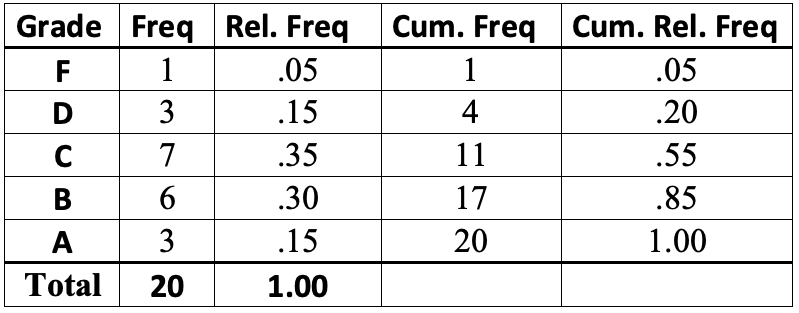
```


<font color = "red">**Remarks**</font>:  (1). The cumulative categories are defined to be F, D or below, C or below, etc.  (2). For a nominal data, the cumulative frequency table may not be practically meaningful because the combined categories may not make practical sense.


## Charting Categorical Data

Two major charts are used to characterize the distribution of a given categorical data set: bar chart and pie chart. Both chart are geometric representations of the frequency table discussed earlier.

### Bar Chart

**Example 2:**  We convert the frequency table of the course grade data in the following

```{r fig.align='center', out.width = '60%'}
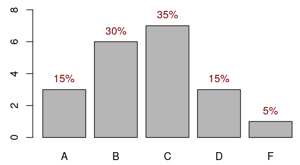
```


**Remark**: We can rearrange the vertical bars in ascending or descending order to get pare-to chart.

```{r fig.align='center', out.width = '60%'}
include_graphics("week01/paretoChart.png")
```


### Pie Chart

To construct a pie chart manually, we need to calculate the degrees of the central angle of the circle and then slice it based on the degrees of the central angle. 

**Example 3**: we still use the course grade frequency table (relative frequency) to to calculate the degrees of the corresponding central angle in the following table.

```{r fig.align='center', out.width = '50%'}
include_graphics("week01/pieChartTable.png")
```


The corresponding pie chart is given by

```{r fig.align='center', out.width = '50%'}
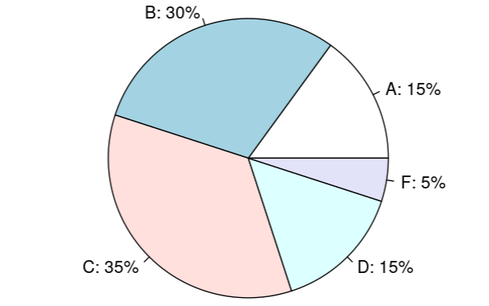
```


# Summary of Numerical Data

There are primarily two methods that are commonly used to summarize a given numerical data: Frequency tables and histograms.

## Frequency Table

A histogram displays numerical data by <font color = "red"><b>grouping data into "bins" of equal width</b></font>. Each bin is plotted as a bar whose height corresponds to how many data points are in that bin. Bins are also sometimes called "intervals", "classes", or "buckets".

There are several steps to follow when creating bins (with equal width):

* Determine the number of bins

* Extend data window (from the smallest to the largest data values) if necessary to get "convenient" end values of the extended window. <font color = "red"><b>Caution:</b></font> never shrink the data window because we must include all data values in one and only one of the bins!

* Find the boundary values (cut-offs) so that all bins have equal width which is equal to **data-window-width/number-of-bins**.

* The number of data values in each bin is the frequency of the bin.


**Example 4 - Length of CD: ** Listed below are the lengths (in minutes) of randomly selected CDs of country, rock, and movie soundtracks.

```
20.5, 29, 32, 32, 32, 33, 36, 37, 38, 39, 39, 43, 47, 48, 49, 49, 49, 
50, 50, 51, 51, 52, 52, 52, 53, 54, 54, 54, 56, 56, 57, 58, 60, 61, 62, 
62, 69, 73, 74, 74.5 
```

**Solution: ** we follow the above suggested steps to define bins illustrated in the following figure.

```{r fig.align='center', out.width = '80%'}
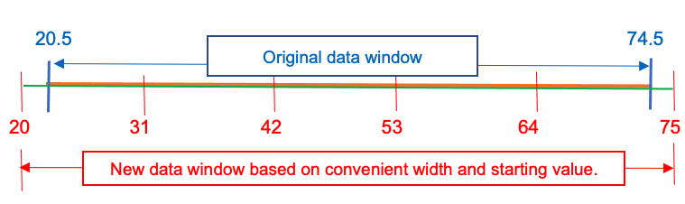
```


* The number of bins chosen for this frequency table is 5.

* The original data window is '[20.5, 74.5]'. The two end values are decimals. We extended the data window on both sides and get a an extended window [20, 75].

* The bin width = (75-20)/5 = 11.

* The boundaries of the 5 bins are: 20, 31, 42, 53, 64, 75.

* the five bins are: [20, 31], (31, 42], (42, 53], (53, 64], (64, 75]. Note that the boundary values must be included in one and only one bins. We use `"["` and `")"` to denote <font color = "red"><b>inclusion</b></font> and <font color = "red"><b>exclusion</b></font> respectively.  For example, in the second bin [31, 42), 31 is included in [31, 42) but 42 is NOT included in [31, 42). It is included in [42, 53).

* with the above defined bins, the resulting frequency tables are given by


```{r fig.align='center', out.width = '60%'}
include_graphics("week01/numFreqTable.png")
```


## Histogram

Similar to the bar chart and pie chat, a histogram is also a geometric representation of the frequency table constructed above. Since the bins are defined based on the numerical boundaries, they must be placed on the correct scales when constructing a histogram. This also means that the histogram is different from the bar chart in different perspectives:

* There is no gaps between the adjacent vertical bars because the horizontal axis is a numerical axis.

* We cannot rearrange the vertical bars as we did in a bar chart to make a pareto chart since we cannot shuffle the boundaries on the numerical axis.

**Example 5 - Length of CD (cont'd):**  The histogram based on the frequency table is given in the following.

```{r fig.align='center', out.width = '60%'}
include_graphics("week01/lengthCDHist.png")
```

# Numerical Measures

This section focuses on using numerical measures to characterize numerical data sets. The numerical measures are used to describe the features such as mean, variance, and percentiles of a given numerical data set. These numeric measures are classified into three categories: central tendency, variation, and locations.

**Notations Using Greek Letters for Parameters**

Every data set has a name. For example, the set of heights of a group of WCU students is a data set that can be named `h` or `height`. We can give each data value has a "generic name" such as $h_1, h_2, \cdots, h_5$, etc. The following figure gives other examples of generic names of values in different data sets. 


```{r fig.align='center', out.width = '60%'}
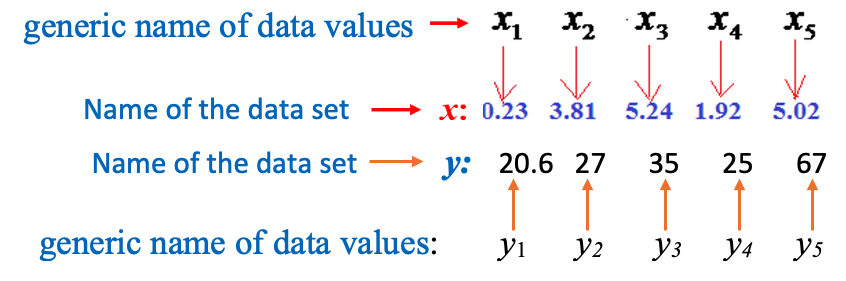
```


**Big Sigma ($\Sigma$) Notation**


These **generic names** for data values allow for compact formulas in numerical measures. Using the name $x$ from the figure above, the sum of all data values in a set is given by the following **big sigma** notation.


```{r fig.align='center', out.width = '50%'}
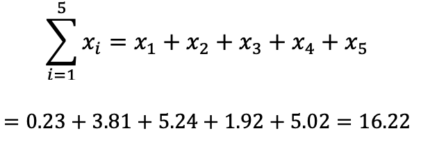
```
 

**Example 6**: Consider the following two data sets with names **x** and **y**, we want to take the product of the corresponding values and sum up the product of the corresponding values. The following is the **big sigma** notation of the **sum of the cross-product**.

```{r fig.align='center', out.width = '70%'}
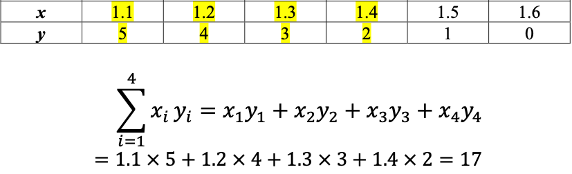
```


**Notations for Parameters and Statistics**

We use Greek letters to denote the population parameters of populations and English letters to denote statistics from the samples.

```{r fig.align='center', out.width = '70%'}
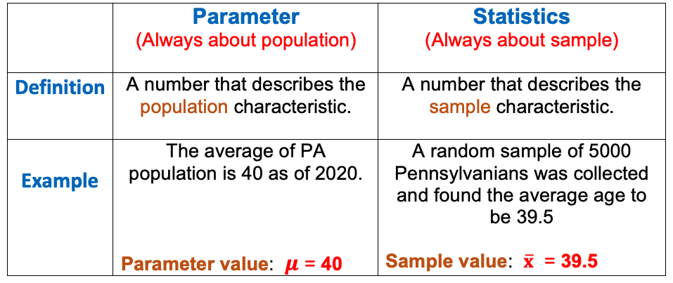
```

\

## Measures of Center

Three measures are used as the center of a given numeric data set.

```{r fig.align='center', out.width = '60%'}
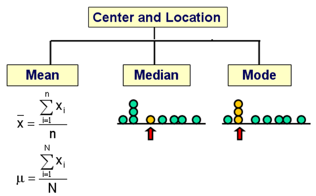
```


### Mean

The mean of a given data set is defined as the average of all data values. The big sigma notations of sample and population means are given by

```{r fig.align='center', out.width = '50%'}
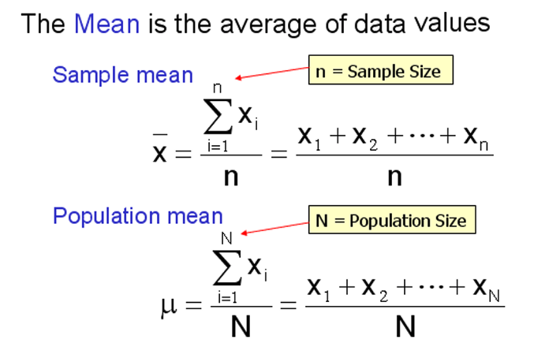
```

**Remark**: the mean can be affected significantly by outliers (extreme values). For example,


### Median

The middle value of a sorted data set is called the median of the data set. 

* If a data set has an **odd number** of data values, there is a unique "middle" value in the **sorted data** set.

* If a data set has an **even number** of data values, there will be two **middle** values in the **sorted data** set, in this case, the **average** of the two "middle** values is defined to be the median. 


For example, 

*  {2, 6, 7} $\to$ median = 6

*  {1, 2, 6, 7} $\to$  median = (2 + 6) / 2 = 4.


### Mode

The mode(s) is (are) the data value(s) with highest frequency.

*	If there is only one mode, the data set is unimodal.
*	If there are two modes, the data set is bimodal.
* If there are more than two modes, the data is multi-modal.

```{r fig.align='center', out.width = '55%'}
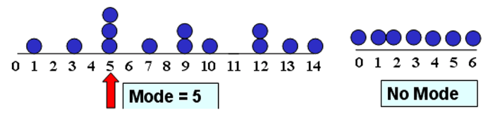
```


### Relationship between Mean, Median, and Mode

The relationship between mean, median, and mode is dependent on the shape of the distribution. The following figure illustrates this relationship.

```{r fig.align='center', out.width = '70%'}
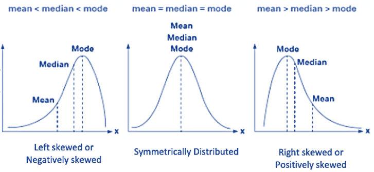
```


## Measures of Variation

Measures of variation are used to characterize the shape of the distribution. There are some different measures used in different situations. We only introduce the variance and the standard deviation in this course. We will also briefly introduce IQR in the applications of numerical measures.

### Variance

Since the definitions of sample and population variances are different, we need to choose an appropriate formula based on whether the data set is a population or a sample. This information is provided to you before you select a formula to calculate the variances. The exact definitions using big sigma notation are given below

* Population Variance

$$
\sigma^2 = \frac{\Sigma_{i=1}^N (x_i-\mu)^2}{N}=\frac{(x_1-\mu)^2 + (x_2-\mu)^2+\cdots+(x_N-\mu)^2}{N}
$$

* Sample Variance


$$
s^2 = \frac{\Sigma_{i=1}^n (x_i-\bar{x})^2}{n-1}=\frac{(x_1-\bar{x})^2 + (x_2-\bar{x})^2+\cdots+(x_n-\bar{x})^2}{n-1}
$$

We can see the only difference is in the denominator of the two definitions.


### Standard Deviation

Once the variance is calculated, we simply take the square root to obtain the standard deviation

* Population standard deviation

$$
\sigma = \sqrt{\frac{\Sigma_{i=1}^N (x_i-\mu)^2}{N}} = \sqrt{\frac{(x_1-\mu)^2 + (x_2-\mu)^2+\cdots+(x_N-\mu)^2}{N}}
$$

* Sample Standard Deviation


$$
s = \sqrt{\frac{\Sigma_{i=1}^n (x_i-\bar{x})^2}{n-1}}=\sqrt{\frac{(x_1-\bar{x})^2 + (x_2-\bar{x})^2+\cdots+(x_n-\bar{x})^2}{n-1}}
$$

### Steps for Calculating Variance

The following are steps for calculating the variance of a data set.

```{r fig.align='center', out.width = '65%'}
include_graphics("week01/calcVariance.png")
```


**Example 7** The following table illustrates how to use the above steps to calculate the variance of a small **sample** toy data set: A = {1,4,7}.   

```{r fig.align='center', out.width = '55%'}
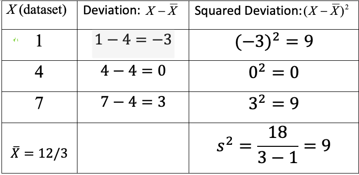
```


Based on the above table, we can see that the standard deviation is $\sqrt{9} = 3$ .


## Measures of Location

Two important types of measures of location will be introduced in this course: z-score and percentiles.

### z-score 

A Z-score of a value of a **sample** data set is a standardized score that is defined by

$$
z = \frac{x - \bar{x}}{s}.
$$

We can easily adjust the above formula for a population as

$$
z = \frac{x - \mu}{\sigma}.
$$

**Example 8**: We still use the same sample toy data, A = {1,4,7}, used in **Example 7** to illustrate how to find z-scores of corresponding data values.  

**Solution: ** We know from **Example 7** that $\bar{x} = 4$ and $s = 3$. Therefore, the z-scores of the corresponding data values are calculated in the following.

$x_1 = 1 \to z_1 = \frac{1 - 4}{3} = -1$

$x_2 = 4 \to z_2 = \frac{4 - 4}{3} = 0$

$x_3 = 7 \to z_3 = \frac{7 - 4}{3} = 1$

That is, the standardized set of z-scores is $\{ -1, 0, 1\}$. Note this is a set of sample z-scores. We can easily verify that the mean and standard deviation of the above three z-scores are 0 and 1 respectively. 


### Percentile

A **percentile** indicates the percentage of scores that fall below a particular value.  

**Example 9** Consider the following PSAT percentile table.

```{r fig.align='center', out.width = '45%'}
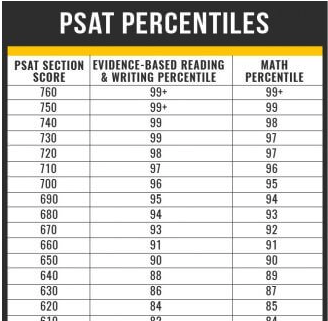
```


If you took PSAT and scored 640 in the MATH section, according to the above table, your MATH percentile is 89% meaning that 89% of all examinees scored below 640 in the PSAT. This also means that you did better than 89% of your peers on the PSAT.

**Steps for Calculating Percentiles**

Assume that we have a data set $\{ x_1, x_2, \cdots, x_n \}$. we want to find $k-th$ percentile, denoted by $P_k$.

**Step 1:** Sort the data in ascending order:  $\{ x_{(1)}, x_{(2)}, \cdots, x_{(n)} \}$.

**Step 2:** Calculate the `rough location` of the $k-th$ percentile
$$L = \frac{k}{100}\times n.$$

**Step 3:** The $k^{th}$ percentile is obtained depending on the form of $L$.

* if $L$ is a whole number, then the $k^{th}$ percentile is the average of the number in position $L$ and the number in position $L+1$ in the sorted data set.

* if $L$ is NOT a whole number, round it **up** to the next higher whole number. The $k^{th}$ percentile is the number in the position corresponding to the **rounded-up** value.


**Example 10:** Consider the following data set

```
9, 13, 7, 7, 12, 15, 10, 10, 6, 19, 17, 10, 15, 9, 14, 12, 9, 13, 7, 
7, 4, 8, 19, 5, 18, 20, 14, 1, 23, 10, 10, 7, 22, 9, 1
```

Find $P_{40}$ and $P_{55}$ percentiles respectively.

**Solution** we first sort the data in ascending order.
```
1, 1, 4, 5, 6, 7, 7, 7, 7, 7, 8, 9, 9, 9, 9, 10, 10, 10, 10, 10, 12, 12,
13, 13, 14, 14, 15, 15, 17, 18, 19, 19, 20, 22, 23
```

For convenience, we have organized the sorted data values into the table below, including the corresponding physical location ID in parentheses.

```{r fig.align='center', out.w = "100%"}
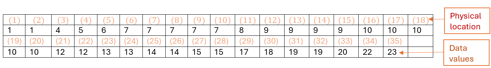
```


**To find 40th percentile**, 

$$
L = \frac{40}{100}\times 35 = 14.
$$
Since $L = 14$ is an integer, the 20th percentile is the average of 14th and 15th data values in the sorted data set. That is, (9 + 9)/2 = 9.

**To find 55th percentile**, 

$$
L = \frac{55}{100}\times 35 = 19.25.
$$

Since $L=19.25$ is NOT an integer, we round up L to get **20**. The 55th percentile is the 20th data value in the sorted data set which is 10.


### Applications of Numeric Measures

Three concepts based on the numeric measures will be introduced in the following.

\

**Five Number Summary** 

\

The five number summary consists of the minimum, 25th, 50th, 75th percentiles, and the maximum. The 25th, 50th, and 75th percentiles are also called the first ($Q_1$), second ($Q_2$) and third quartiles ($Q_3$), respectively.

**Example 11: **  We use the **length of CD** data to show the five-number-summary. The unit of data values is minute. The following is the sorted data.
```
20.5, 29, 32, 32, 32, 33, 36, 37, 38, 39, 39, 43, 47, 48, 49, 49, 49, 
50, 50, 51, 51, 52, 52, 52, 53, 54, 54, 54, 56, 56, 57, 58, 60, 61, 62, 
62, 69, 73, 74, 74.5 
```
**Solution**, The minimum and maximum are 20.5 and 74.5 minutes. The quartiles are calculated in the following.

$Q_1:  L = (25/100) \times 40 = 10$, $Q_1$ is the average of the 10th and 11th data values $= (39+39)/2 = 39$.

$Q_2:  L = (50/100) \times 40 = 20$, $Q_1$ is the average of the 20th and 21st data values $= (51 + 51)/2 = 51$.

$Q_3:  L = (75/100) \times 40 = 30$, $Q_1$ is the average of the 30th and 31st data values $= (56+57)/2 = 56.5$.

Therefore, the five-number-summary is given by

```
     Min      Q1       Q2        Q3        Max
    20.5      39       51       56.5       74.5
```

\

**Box-plot** 

\

The box-plot is a geometric representation of the five-number-summary given in the following figure

```{r fig.align='center', out.width = '60%'}
include_graphics("week01/boxPlot.png")
```


Box-plots are used to describe the distribution of data. The following three box-plots represent three different types of distributions:

```{r fig.align='center', out.width = '60%'}
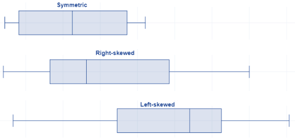
```

**Example 12:  (Length of CS Continued)**  The box-plot is given by

```{r fig.align='center', out.width = '70%'}
include_graphics("week02/boxPlotExample.png")
```

\

**Inter-quartile Range (IQR)** 

\

The inter-quartile range of data is defined by $IQR = Q3 - Q1$. IQR is used to measure the variation of the data set. It is NOT sensitive to extremely large and small values since IQR is defined only based on the "middle 50% of data values".

```{r fig.align='center', out.width = '55%'}
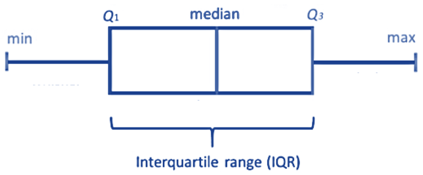
```

\


# Use of Technology - ISLA

For this course, I have developed a suite of **Interactive Statistics Learning Applications (ISLA)** to help you learn statistical concepts. You can find the complete list on the course website under the **ISLA** tab in the top navigation panel.

Next, we use the first App to produce the answers to examples that we used in this note. The App can be found at <https://wcupeng.shinyapps.io/DescriptiveStats/>. You need to type in data values and relevant information to generate frequency tables and charts.

\


## Course Grade Data

**Example 1**: In a class of 20 students, 3 students received a grade of “A”, 6 students received a “B”, 7 students received a “C”, 3 students received a “D”, and 1 student received an “F”. These results are summarized, in a variety of ways, in the following table:  (Note that for the ordered categorical variable “Grade” we also create the discrete quantitative variable “Grade-point”.)

```
A,  C,  B,  F,  D,  B,  C,  B,  C,  C,  A,  D,  C,  B,  C,  B,  A,  C,  B,  D
```


The following show the frequency table generated from the App using the course letter grades. You can try to generate bar charts and pie charts using this app.


```{r fig.align='center', out.width = '99%'}
include_graphics("week01/cateFreq.png")
```


## Length of CD data

The following frequency table was generated by the app using the CD length data from the example. You can use this same app to create histograms; however, please note that you must provide the boundary values to generate accurate frequency tables and histograms.


```{r fig.align='center', out.width = '99%'}
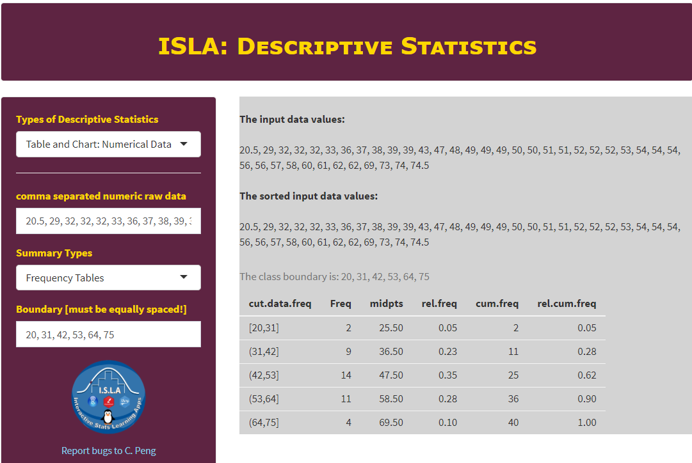
```


We next still use the same app that we used in the previously to find various numerical measures to summarize a given data set. The app can be found at <https://wcupeng.shinyapps.io/DescriptiveStats/>. The next screenshot illustrates the measures of variations in the length of CD data. You can choose to find other numerical measures of the data.

```{r fig.align='center', out.width = '95%'}
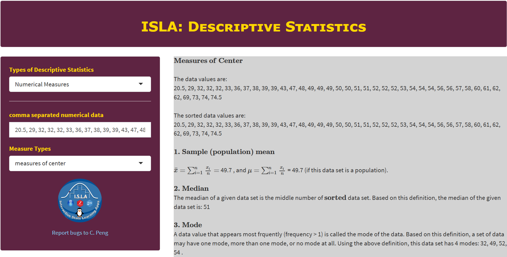
```


## Example: Descriptive Statical Analysis of Course Grade

The following are grades of a weekly assignment:

```{}
4.98,  5.98,  6.48,  7.00,  7.49,  7.49,  7.98,  7.98,  7.99,  7.99,  8.00,
8.00,  8.00,  8.02,  8.02,  8.49,  8.49,  8.50,  8.50,  8.50,  8.50,  8.50,
8.50,  8.50,  8.51,  8.51,  8.51,  8.98,  8.99,  8.99,  8.99,  8.99,  9.00,
9.00,  9.00,  9.00,  9.00,  9.01,  9.01,  9.01,  9.01,  9.01,  9.01,  9.01,
9.02,  9.02,  9.02,  9.48,  9.51,  9.98,  9.98,  9.99,  9.99, 10.00, 10.00,
10.00, 10.00
```

The questions we may be interested in are:


1. What is the grade distribution (i.e., frequency or histograms).

```{r fig.align='center', out.width = '95%'}
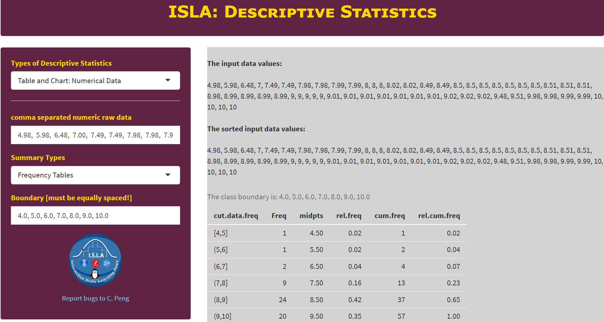
```

2. we also may want to know the class average, median, variance and standard deviation, etc.

```{r fig.align='center', out.width = '95%'}
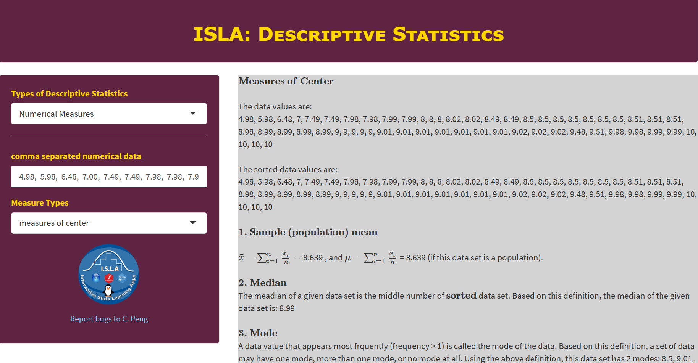
```
\

```{r fig.align='center', out.width = '95%'}
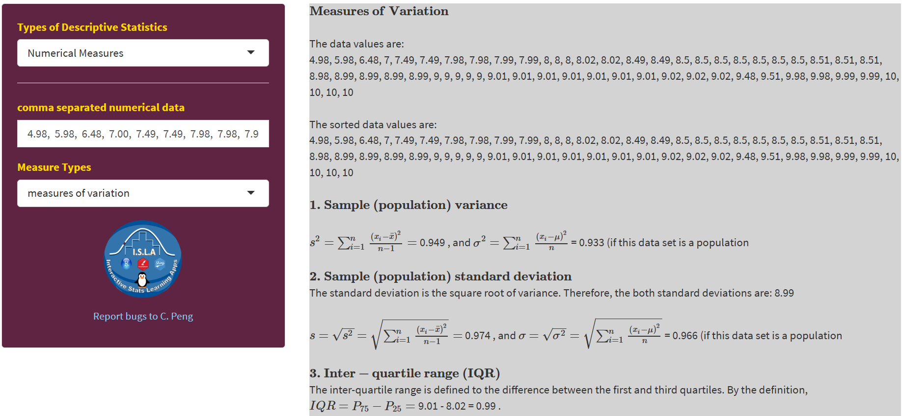
```


3. We may also want to see the 5-number summary and box-plot

```{r fig.align='center', out.width = '95%'}
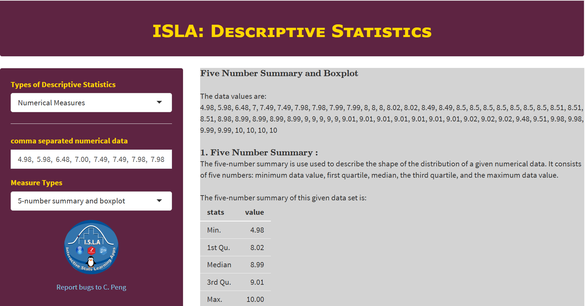
```

4. We can also standardize the grades by z-score transformation and find inter-quartile range (IQR).

*See the screenshot in problem 7.*


<!-- The follow video demonstrate how to use the app to answer the above questions.

\

<!--center><a href="https://mat121.s3.amazonaws.com/w02-LearningStrategies.mp4"></a-->

\


\

# Exercises

Summarize the following data sets by using frequency tables (relative frequency, cumulative frequency, etc.) and histogram. You can use `ISLA` to check your work.


**Exercise 1**. Weights of 18- to 24- Year- Old Males. The U. S. National Center for Health Statistics publishes data on weights and heights by age and sex in the document Vital and Health Statistics. The weights shown in the following, given to the nearest tenth of a pound, were obtained from a sample of 18- to 24- year- old males. Use the cut-point grouping to organize these data into frequency and relative- frequency distributions. Use a class width of 20 and a first cut-point of 120.

```
129.2, 132.1, 136.7, 142.8, 145.6, 146.4, 149.9, 150.7, 151.3, 155.2, 158.5, 
158.6, 161.0, 161.7, 165.0, 165.8, 167.3, 170.0, 170.1, 172.5, 173.6, 173.7, 
175.4, 175.6, 178.2, 178.7, 182.0, 182.5, 185.3, 187.0, 187.5, 188.7, 191.1, 
209.1, 214.6, 218.1, 278.8
```
                                
**Exercise 2**. The following are the miles per gallon.
```
22.8, 22.9, 23.3, 23.4, 23.6, 23.7, 23.8, 23.9, 23.9, 24.1, 24.1, 24.2, 24.3, 
24.4, 24.5, 24.5, 24.6, 24.6, 24.7, 24.7, 24.7, 24.8, 24.8, 24.9, 24.9, 25.0, 
25.0, 25.1, 25.2, 25.3
```

**Exercise 3**. Following are 80 measurements of the iron-solution index of tin-plate specimens, designed to measure the corrosion resistance of tin-plated steel. The original data set has been sorted in an ascending order as: 

```
14,  26,  28,  28,  28,  28,  30,  32,  34,  35,  36,  36,  37,  37,  40, 40,  
40,  41,  41,  41,  42,  42,  42,  43,  43,  43,  44,  44,  44,  44,  45, 45,  
45,  45,  45,  45,  46,  46,  46,  46,  47,  47,  47,  48,  49,  49,  49, 50,  
50,  50,  51,  52,  52,  52,  52,  52,  53,  53,  54,  54,  54,  54,  55, 55,  
55,  55,  55,  55,  55,  56,  56,  56,  56,  56,  56,  57,  57,  57,  57, 57,  
58,  58,  58,  58,  58,  59,  59,  60,  60,  60,  60,  61,  61,  61,  61, 61,  
62,  62,  62,  62,  62,  62,  63,  63,  63,  63,  63,  63,  64,  65,  66, 66,  
67,  68,  68,  69,  69,  70,  70,  70,  70,  70,  70,  71,  71,  72,  72, 72,  
73,  74,  74,  74,  76,  76,  77,  77,  79,  80,  81,  81,  83,  83,  84, 86,  
86,  86,  87,  89,  92,  95
```

**Exercises 4**.  From the 140 children whose urinary concentration of lead were investigated 40 were chosen who were aged at least 1 year but under 5 years. The following concentrations of copper were found.
```
0.70, 0.45, 0.72, 0.30, 1.16, 0.69, 0.83, 0.74, 1.24, 0.77, 0.65, 0.76, 0.42, 0.94, 
0.36, 0.98, 0.64, 0.90, 0.63, 0.55, 0.78, 0.10, 0.52, 0.42, 0.58, 0.62, 1.12, 0.86, 
0.74, 1.04, 0.65, 0.66, 0.81, 0.48, 0.85, 0.75, 0.73, 0.50, 0.34, 0.88
```


**Exercise 5** The following data set represents the shoe sizes of 100 random selected students from a large university. 
```
8.0, 13.0, 8.5, 9.0, 11.0, 9.5, 10.0, 8.0, 11.0, 8.0, 10.0, 11.0, 10.0, 11.0, 6.0, 
9.0, 8.0, 8.0, 12.0, 10.5, 9.5, 11.0, 6.0, 8.0, 10.0, 11.5, 11.0, 7.0, 10.5, 15.0, 
12.0, 8.5, 8.0, 10.0, 8.0, 7.0, 10.5, 10.0, 5.0, 7.0, 10.0, 14.0, 14.0, 8.5, 8.0, 
13.0, 11.0, 6.0, 8.0, 11.5, 8.5, 7.0, 12.5, 8.5, 15.0, 10.0, 6.0, 11.0, 11.0, 10.0, 
10.5, 11.0, 7.5, 7.0, 7.5, 10.5, 10.0, 11.0, 9.5, 11.0, 9.5, 10.5, 7.5, 11.0, 13.0, 
10.0, 9.0, 12.0, 8.0, 8.0, 9.0, 12.0, 8.5, 8.0, 11.0, 9.0, 9.0, 7.0, 9.0, 12.0, 5.5,
9.5, 8.0, 9.0, 12.0, 9.5, 9.0, 11.0, 13.0, 7.5
```

`Caution`: The data values are given in the numeric form, but they are labels shoe sizes. Therefore, this is a categorical data set.


The following two exercises are taken from the previous note. Please answer the following two questions manually before using ISLA app to check your answer.

1. Construct a histogram with 5 classes.

2. Find the five numer summary and the corresponding box-plot.


**Problem 6**. Following are 80 measurements of the iron-solution index of tin-plate specimens, designed to measure the corrosion resistance of tin-plated steel. The original data set has been sorted in an ascending order as: 

```
14,  26,  28,  28,  28,  28,  30,  32,  34,  35,  36,  36,  37,  37,  40, 40,  
40,  41,  41,  41,  42,  42,  42,  43,  43,  43,  44,  44,  44,  44,  45, 45,  
45,  45,  45,  45,  46,  46,  46,  46,  47,  47,  47,  48,  49,  49,  49, 50,  
50,  50,  51,  52,  52,  52,  52,  52,  53,  53,  54,  54,  54,  54,  55, 55,  
55,  55,  55,  55,  55,  56,  56,  56,  56,  56,  56,  57,  57,  57,  57, 57,  
58,  58,  58,  58,  58,  59,  59,  60,  60,  60,  60,  61,  61,  61,  61, 61,  
62,  62,  62,  62,  62,  62,  63,  63,  63,  63,  63,  63,  64,  65,  66, 66,  
67,  68,  68,  69,  69,  70,  70,  70,  70,  70,  70,  71,  71,  72,  72, 72,  
73,  74,  74,  74,  76,  76,  77,  77,  79,  80,  81,  81,  83,  83,  84, 86,  
86,  86,  87,  89,  92,  95
```

**Problem 7**.  From the 140 children whose urinary concentration of lead were investigated 40 were chosen who were aged at least 1 year but under 5 years. The following concentrations of copper were found.
```
0.70, 0.45, 0.72, 0.30, 1.16, 0.69, 0.83, 0.74, 1.24, 0.77, 0.65, 0.76, 0.42, 
0.94, 0.36, 0.98, 0.64, 0.90, 0.63, 0.55, 0.78, 0.10, 0.52, 0.42, 0.58, 0.62, 
1.12, 0.86, 0.74, 1.04, 0.65, 0.66, 0.81, 0.48, 0.85, 0.75, 0.73, 0.50, 0.34, 0.88
```


