```{css echo = FALSE}
<style type="text/css">

div#TOC li {
    list-style:none;
    background-image:none;
    background-repeat:none;
    background-position:0;
}
h1.title {
  font-size: 24px;
    font-weight: bold;
  color: DarkRed;
  text-align: center;
}
h4.author { /* Header 4 - and the author and data headers use this too  */
    font-size: 18px;
    font-weight: bold;
  font-family: "Times New Roman", Times, serif;
  color: DarkRed;
  text-align: center;
}
h4.date { /* Header 4 - and the author and data headers use this too  */
  font-size: 18px;
    font-weight: bold;
  font-family: "Times New Roman", Times, serif;
  color: DarkBlue;
  text-align: center;
}

h1 { /* Header 1 - and the author and data headers use this too  */
    font-size: 20px;
    font-weight: bold;
    font-family: "Times New Roman", Times, serif;
    color: darkred;
    text-align: center;
}
h2 { /* Header 2 - and the author and data headers use this too  */
    font-size: 18px;
    font-weight: bold;
    font-family: "Times New Roman", Times, serif;
    color: navy;
    text-align: left;
}

h3 { /* Header 3 - and the author and data headers use this too  */
    font-size: 16px;
    font-weight: bold;
    font-family: "Times New Roman", Times, serif;
    color: navy;
    text-align: left;
}

</style>
```


```{r setup, include=FALSE}
# code chunk specifies whether the R code, warnings, and output 
# will be included in the output files.
if(!require('eulerr')) {
  install.packages('eulerr')
  library(eulerr)
}
if (!require("knitr")) {
   install.packages("knitr")
   library(knitr)
}
if (!require("grid")) {
   install.packages("grid")
   library(grid)
}
if (!require("VennDiagram")) {
   install.packages("VennDiagram")
   library(VennDiagram)
}
if (!require("ggVennDiagram")) {
   install.packages("ggVennDiagram")
   library(ggVennDiagram)
}
if(!require('plotly')) {
  install.packages('plotly')
  library(plotly)
}
if(!require('patchwork')) {
  install.packages('patchwork')
  library(patchwork)
}
#patchwork
# knitr::opts_knit$set(root.dir = "C:/Users/75CPENG/OneDrive - West Chester University of PA/Documents")
# knitr::opts_knit$set(root.dir = "C:\\STA490\\w05")

knitr::opts_chunk$set(echo = FALSE,       
                      warning = FALSE,   
                      results = TRUE,   
                      message = FALSE,
                      comment = FALSE)
```
\

>  **Q**:  Why do we need to study probability?<BR>
   **A**:  We can build a bridge between a sample and its population so that one can make inferences about the population from its samples.


# Introduction

In this note, we introduce the definitions of probability, random variables, and problems associated with a distribution based on a special distribution: uniform distribution.

# Definitions of Probability

We need to use the following concepts to define or approximate the probability of an event.


## Experiment and Event


**An experiment** is any process that generates well-defined outcomes. On any single repetition of an experiment, one and only one of the possible experimental outcomes will occur.


<font color = "darkred"><b>Example 1.</b></font> The following table gives several examples of experiments.

```{r fig.align='center', out.width = '55%'}
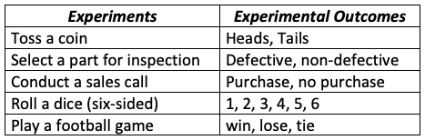
```


**The Sample Space** of an experiment is the set of all possible outcomes. We usually use a capital letter in Greek or English to denote the sample space. For example, $\Omega$, $S$, or $U$.

<font color = "darkred"><b>Example 2.</b></font> Consider the experiment of tossing a balanced coin sequentially for 2 times.  We use H to denote the heads and T to denote the tails. 

```{r fig.align='center', out.width = '40%'}
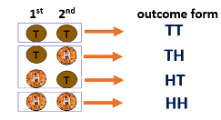
```


Therefore, the sample space of this experiment is $\Omega = \{ TT, TH, HT, HH \}$.


**An Event** is a subset of outcomes from the sample space. We usually use a capital letter to denote an event.

<font color = "darkred"><b>Example 3.</b></font> We define Event E to be at least one H is observed in the coin tossing example.  

**Solution: ** The outcomes in the subset $\{HT, TH, HH\}$ satisfy the requirement in the definition. Therefore, event E is defined by $E = \{ HT, TH, HH\}$.


# Definition of Probabilities
         
**Notations: **   We use $P$ or $Pr$ to denote the probability and  $A, B, C, \cdot,$ to denote specific events. $P(A)$ is the probability that event A occurs.


## Definitions of Probability

* **Method 1:** Relative Frequency Approximation of Probability.

Conduct or observe an experiment a large number of times and count the number of times that event A occurs. Based on these actual results, P(A) is estimated as follows:
```
            P(A)= (# of times of A being observed) / (# of repeated trials)
```


* **Method 2:** Classical Approach to Probability (Requires Equally Likely Outcomes of the experiment)
```
              P(A) = (# of outcomes in A) / (# of outcome in S) 
```

## Some Examples

<font color = "darkred"><b>Example 4.</b></font> **Guessing Answers on an ACT:** A typical multiple-choice question has 5 possible answers. If you make a random guess on one question, what is the probability that your response is wrong?

**Solution**:  Method 2 classical approach applies to this question since each of the choices is random, that is, each of the 5 letters A, B, C, D, and E are equally likely to be selected as the correct answer.
```
                Pr(wrong answer) = 4 / 5 =0.8
```
\

<font color = "darkred"><b>Example 5.</b></font> **Gender of Children**: Find the probability that a randomly selected couple with 3 children will have exactly 2 boys. Assume that boys and girls are equally likely, and the gender of any child is not influenced by the gender of any other child.

**Solution** Based on the given condition, this is an equally likely experiment. We first use a table to list all possible outcomes in the sample space. Let B = boy and G = girl. Then the following table lists all possible outcomes of this experiment.


```{r fig.align='center', out.width = '40%'}
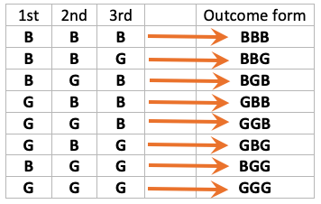
```


We list the sample space as follows
```
                S = { BBB   BBG   BGB   GBB   GGB   GBG   BGG   GGG }
                E =  having exactly 2 boys = { BBG   BGB   GBB }. 
``` 
The desired probability can be calculated as 
```
                     Pr(E)= #E/#S  = 3 / 8 =0.375.
```


##	Discrete Probabilities on Contingency Tables

Contingency tables classify outcomes in rows and columns. Table cells at the intersections of rows and columns indicate frequencies of both events coinciding.

<font color = "darkred"><b>Example 6.</b></font> The following table displays events for computer sales at a fictional store. 

```{r fig.align='center', out.width = '50%'}
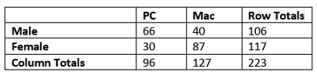
```


Specifically, it describes the frequencies of sales by the customer’s gender and the type of computer purchased. The cells’ counts represent the number of PCs and Macs purchased by both genders. 

Finding the following probabilities:

(1). Randomly select a female customer, what is the probability that she bought a Mac computer?

(2). Randomly select a customer from those who bought a computer from the store, what is the probability that the customer is a male?

(3).  Randomly select a customer who bought a computer from the store, what is the probability she/he bought a Windows computer?

(4). Randomly select a customer who bought a computer from the store, what is the probability that the customer is female and bought a Mac computer?

**Solution**  (1). $P$(Mac among female) $= 87/117 = 0.744$

(2). $P$(male among customers who bought a computer) $= 106/223 = 0.4753$

(3). $P$(windows among all computers sold) $= 96/223 = 0.4305$

(4). $P$(female & bought a mac computer) $= 87/223 = 0.3901$


# Venn Diagram Representation

A Venn diagram shows the sample space, S, as a unit area (typically a rectangle), and 
the probabilities of events as areas whose sizes are the probabilities of the events. 
The size of overlap between areas indicates the probability of intersections of events.


```{r fig.align='center', out.width="45%"}
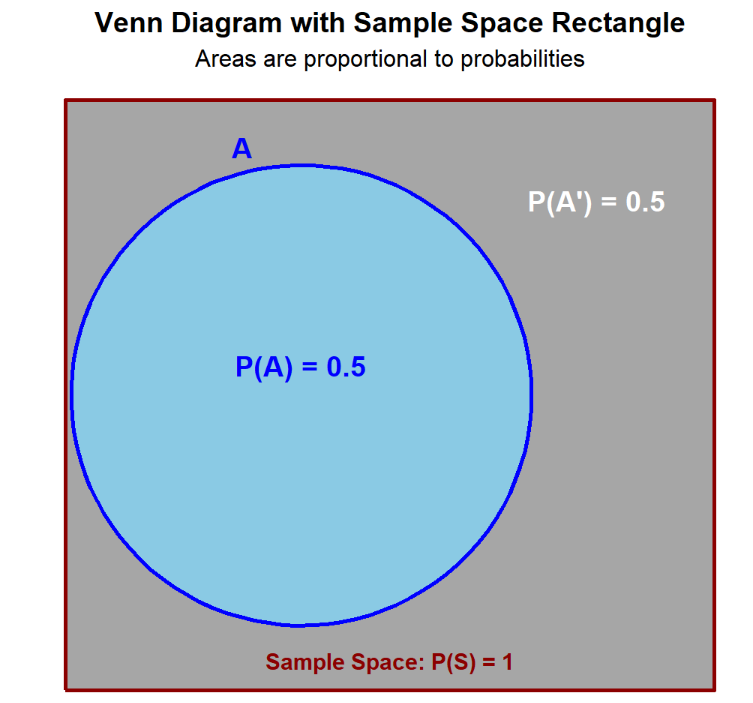
```


**Sample Space (S)**: The **entire rectangle** (including the circular region) represents all possible outcomes of an experiment.

**Event A**: Circles (**sky blue region**) within the rectangle represent a specific event or subset of the sample space.

**Complement ($A^\prime$)**: Elements not in A (**dark gray region**).


\

**Multiple Events Representation**


```{r fig.align='center', out.width="45%"}
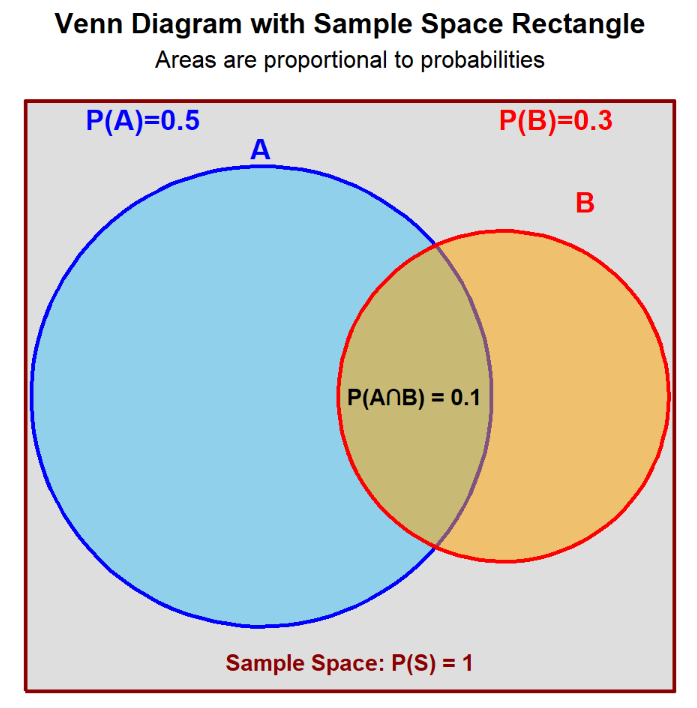
```

Key Regions defined based on existing events **A** and **B** in Venn Diagrams:

**Union (A $\cup$ B)**: All elements in **either A or B or both**. 

**Intersection (A $\cap$ B)**: Elements common to **both A and B** (see the above figure).

**Mutually Exclusive**: No overlap between events. The following Venn diagram shows the exclusive events **C** and **D**.
 

```{r fig.align='center', out.width="45%"}
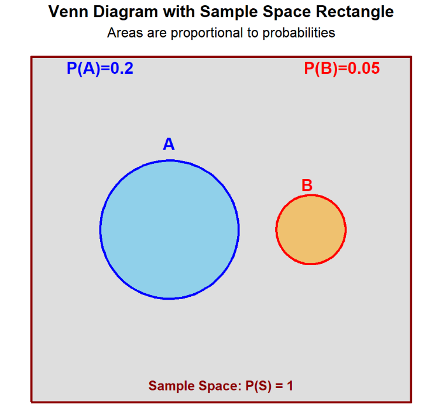
```


# Basic Probability Rules


Probability measures an event's likelihood from 0 (impossible) to 1 (certain). We have introduced the three operations to define **new events** based on the existing events. The goal is how to find the probability of the derived **events** based on the probabilities of existing events. This section output the logic and rules of finding the probability of the derived **new events** using the following basic rule.

## The Complement Rule

**The complement rule** states that the probability an event does not happen is 1 minus the probability it does. According to the definition, the rule is depicted in the following figure (which is also given previously)

```{r fig.align='center', out.width="45%"}

```


## Additition Rule

**The addition rule** (also called additive rule) finds the probability of either event A or B occurring; 

* For mutually exclusive events (the two events are not overlaped!), we add their probabilities. 

```{r fig.align='center', out.width="45%"}

```

That is,

$$
P(A\cup B) = P(A) + P(B).
$$

* For overlapping events, we must subtract the probability that both occur to avoid double-counting (see the following figure). 
  
```{r fig.align='center', out.width="45%"}
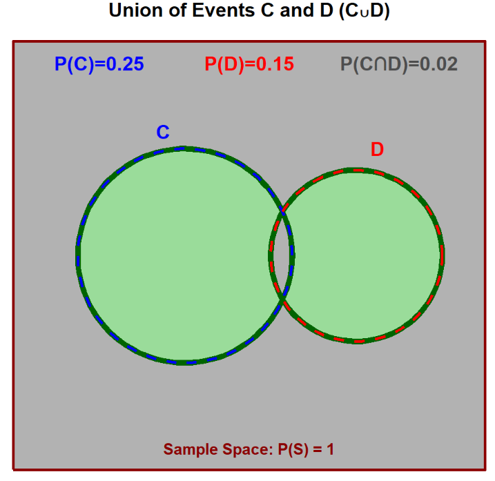
```  
 
That is,

$$
P(C \cup D) = P(C) + P(D) - P(C \cap D).
$$
 
 
**Example 1**. A coffee shop finds that on a Monday morning:

60% of customers order coffee.

40% of customers order a pastry.

25% of customers order both coffee and a pastry.

If a random customer is selected, what is the probability that they:

a) Order coffee or a pastry (or both)?

b) Order neither coffee nor a pastry?

**Solution**:

Let C = event that a customer orders coffee. Then $P(C)=0.60$

Let P = event that a customer orders a pastry.Them $(P)=0.40$ and $P(C \cap P)=0.25$

(a) This is a classic "OR" problem. The events are not mutually exclusive (a customer can order both), so we use the general addition rule:

$$
P(C \cup P)=P(C)+P(P)-P(C \cap P) = 0.60 + 0.40 - 0.25 = 0.75.
$$
Conclusion: The probability a customer orders coffee, a pastry, or both is 75%.


(b). "Ordering neither" is the complement of "ordering coffee or a pastry." We use the complement rule:

$$
P(\text{Neither})=1-P(C \cup P) = 1 - 0.75 = 0.25
$$

Therefore, the probability a customer orders nothing is 25%.


## Conditional Probability and Multiplication Rule  
  
Conditional probability defines the probability of an event occurring based on a given condition or prior knowledge of another event.

It is the **likelihood** of an event occurring, given that another event has already occurred (i.e., this is prior information). In probability, this is denoted as **A** given **B**, expressed as **P(A | B)**, indicating the probability of event A when the event B has already occurred. 

We define two events **Rain** and **Umbrella** based on the following figure.

```{r fig.align='center', out.width="85%"}

```  
         
Based on the definition of probability and rules, we have

* P(**Rain**) = 3/10 = 0.3.

* P(**Umbrella**) = 5/10 = 0.5.

* P(**Rain** $\cap$ **Umbrella**) = 2/10 = 0.2.

* P(**Rain** $\cup$ **Umbrella**) = 6/10 = 0.6.
  
  
We want to find the probability of using an umbrella given the prior information that it rains; this is the conditional probability **P(Umbrella | Rain)**. Intuitively, this probability is only concerned with the days when it rains. That is, it represents the proportion of rainy days on which an umbrella is used.

$$
P(\text{Umbrella}|\text{Rain}) = \frac{\text{number of} (\text{Umbrella}\cap \text{Rain})}{\text{Number of Total Rainny Days}} = \frac{2}{3}.
$$  

The reasoning and answer provided above are correct. <font color="blue">**It is important to note that the sample space for this conditional probability is restricted to rainy days, not the entire 10 days.**</font> <font color="darkred">**Unconditional probabilities, however, are defined based on the complete sample space of all 10 days.**</font> To keep consistency of using the same sample space to define all related probability, we can modify the above conditional probability formula in the following

$$
P(\text{Umbrella}|\text{Rain}) = \frac{\text{number of } (\text{Umbrella}\cap \text{Rain})/10}{\text{Number of Total Rainny Days}/10} = \frac{2/10}{3/10}=\frac{2}{3}.
$$  

The formal definition of the conditional probability uses the same logic and is defined by

$$
P(A|B) = \frac{P(A\cap B)}{P(B)}
$$

The core idea of conditional probability is to use the information that a prior event (B) has occurred to improve the estimate of the probability of the future event (A). The numerator $P(A \cap B)$ represents the probability both A and B occur and denominator $P(B)$ is the probability of the occurrence of event B.

**Independent Events**: Two events are **independent** if $P(A|B) = P(A)$. That is, the information of $B$ does not impact the probability of $A$. 


<font color = "red">**Properties: If two events A and B are independent, their complements $A^\prime$ and $B^\prime$ are also independent.** </font>


**The multiplication rule** finds the probability both A and B occur; 

* For independent events, we multiply their probabilities, while 

* For dependent events, we multiply the probability of the first by the conditional probability of the second given the first.

From the definition of the conditional probability, we have

$$
P(A \cap B) = P(B)\times P(A|B).
$$

By combining the definitions of conditional probability and independent events, we can derive the following rule to test whether two events are independent.

$$
P(A \cap B) = P(A)\times P(B).
$$


**Example 2**:  A factory has two independent production lines, Line A and Line B.

The probability that Line A produces a defective item is 2%.

The probability that Line B produces a defective item is 3%.

An inspector randomly selects one item from Line A and one from Line B. What is the probability that:

a) Both items are defective?

b) Neither item is defective?

c) At least one item is defective?


**Solution**:

Because the lines are **independent**, what happens on one line does not affect the other.

Let $D_A$ = item from Line A is defective. Then $P(D_A)=0.02$

Let $D_B$ = item from Line B is defective. Then $P(D_B)=0.03$


**(a)**. **Both are defective** is an **AND** problem for independent events. Using the multiplication rule of independent events, we have

$$
P(\text{Both Defective}) = P(D_A \cap D_B) =  P(D_A)\times P(D_B) = 0.02×0.03=0.0006.
$$

The event **Neither is defective** is an **AND** problem. The word **ether** implies a negation, meaning we are dealing with the intersection of the complements of the individual **defective** events.   

$$
P(\text{ Not }D_A) = P(D_A^\prime) = 1-0.02=0.98.
$$
 

$$
P(\text{ Not }D_B) = P(D_B^\prime) = 1-0.03=0.97.
$$

The property of **independent** events indicates that the two complementary events are also indepedent, which implies that

$$
P(\text{Neither Defective})= P(\text{ Not }D_A \cap \text{ Not }D_B) = 0.98×0.97=0.9506.
$$

Hence, there is a 95.06% chance that both items are fine.


(c). **At least one is defective** is the complement of **neither is defective.**

$$
P(\text{ At least one defective})=1-P(\text{Neither Defective}) = 1 - 0.9506 = 0.0494.
$$

Therefore, there is a 4.94% chance that at least one of the two items is defective.


\

**Example 3**:   A company classifies its employees by gender and whether they have a university degree.

|  Has Degree	| No Degree |	Total |
|:------------|:----------|:------|
| Male	| 8	| 12	| 20 |
| Female	| 10	| 5	| 15 |
| Total	| 18	| 17	| 35 |

If one employee is selected at random, what is the probability:

a) The employee is female, given they have a degree?

b) The employee has a degree, given they are female?


**Solution**: This problem shows how conditional probability can change the sample space.

**(a)**: In $P(\text{Female} | \text{ Degree})$, the condition is **has a degree.** So, we only look at the **Has Degree** column.

* Total with a degree: 18

* Females with a degree: 10

$$
P(\text{ Female } |\text{ Degree}) = \frac{10}{18} = \frac{5}{9}.
$$

That is, given an employee has a degree, there is a 5/9 chance they are female.

**(b)**. In $P( \text{Degree }| \text{ Female})$, the condition is **is female**. So, we only look at the **Female** row.

* Total females: 15

* Females with a degree: 10

$$
P(\text{Degree }|\text{ Female}) = \frac{10}{15} = \frac{2}{3}.
$$

Consequently, given an employee is female, there is a 2/3 chance they have a degree.

\

## Summary of Probability Rules

The above statements are the basic probability rules. We summarize them in the following table.


```{r  fig.align='center', out.width="85%"}
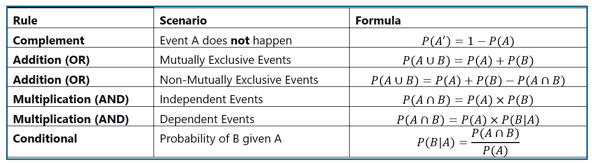
```


**Example 1**. A coffee shop finds that on a Monday morning:

60% of customers order coffee.

40% of customers order a pastry.

25% of customers order both coffee and a pastry.

If a random customer is selected, what is the probability that they:
a) Order coffee or a pastry (or both)?
b) Order neither coffee nor a pastry?


# Basics of Random Variables

Before introducing the definition of random variable, we look at **Gender of Children** example discussed earlier: Find the probability that a randomly selected family with 3 children will have exactly 2 boys. Assume that boys and girls are equally likely and that the gender of any child is not influenced by the gender of any other child.

Based on the given condition, this is an equally likely experiment. We first use a table to list all possible outcomes in the sample space. Let **B = boy** and **G = girl**. Then the following table lists all possible outcomes of this experiment.

```{r fig.align='center', out.width = '40%'}

```

The event **E = 2 boys in a randomly selected family with 3 children**, then 

$$
P(E) = 3/8 = 0.375.
$$

In general, if we define **Y = <font color = "red">number of boys</font> in a randomly selected family with 3 children**, we can define different events based on different values of <font color = "red">**variable**</font> **Y** which has following two features

* It is **unknown** before a family is selected.

* Its value is dependent on the chance. This is because the selection of the family is **random**.

Therefore, a **random variable** differs from a variable in high school algebra in that its value is not predetermined; rather, it is determined by the outcome of a random phenomenon. A more rigorous name for the variable in high school algebra is a **deterministic variable**. Due to this fundamental difference, the methods for characterizing them also differ.

Unlike a deterministic variable, such as $x$ in the equation $2x−1=3$ (which is fully characterized by solving $x=2$), a **random variable** cannot be characterized by a single value due to its inherent uncertainty. We therefore require a different approach, which leads to the following formal definition:


**Definition**: A **random variable** is a <font color = "red">**variable**</font> <font color = "blue">**whose value depends on chance**</font>, meaning it is not fixed but determined by the outcome of a random experiment.


**Since each value of a random variable represents an random event and occurrence of the event is measured by probability ranged between 0 and 1 inclusively, the implies that <font color = "red">a random variable is actually a function</font>**. This leads a more rigorous definition of **random variable**:

**Definition**: A **random variable** is a <font color = "red">**function**</font> that assigns a numerical value to each outcome of a random process (i.e., a random event). Its specific value is uncertain until the process is observed (i.e., the random event occurred).

There are two basic types of random variables: discrete and continuous. In the following section, we will illustrate these types and explain how they are <font color = "red">**defined**</font> and <font color = "red">**characterized**</font>. That is, we will follow the two-step procedure: 

* **Explicit Definition** 

* **Characterization**


## Discrete Random Variables

We use the **gender of children** example to explain **discrete random variable**. First we define the random variable to be

**Y = the number of boys in a randomly selected family with 3 children**.

The random variable $Y$ is clearly discrete, as its possible values are limited to 0, 1, 2, and 3, with no valid outcomes between any two adjacent values. The following chart uses an input-output framework to illustrate how a random variable functions as a mapping.


```{r fig.align='center', out.width = '100%'}
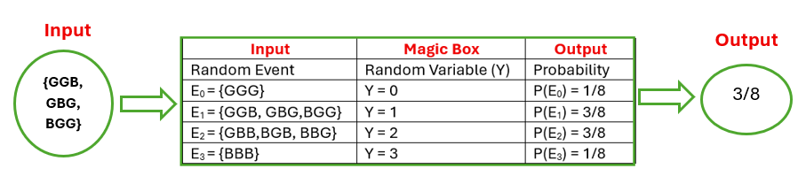
```


The above table contains all the information for the random variable. It is one method to completely characterize the random variable
$Y$ and is called a probability distribution table. To make it cleaner, the probability distribution table of $Y$ is generally given by: 


```{r fig.align='center', out.width = '40%'}
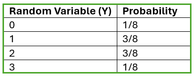
```

For this specific random variable, there are two other methods given below can characterize the distribution.


```{r fig.align='center', out.width = '95%'}
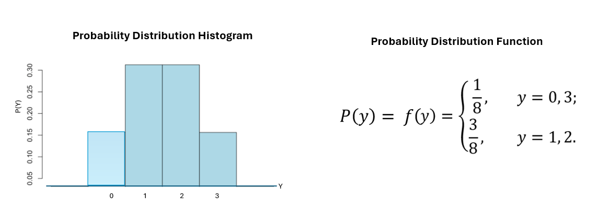
```


We can also observe two fundamental properties of probability distributions:

* **All probabilities are between 0 and 1, inclusive**.

* **The sum of all probabilities is equal to 1**.

\

<font color = "red">**The above properties of distribution can be used to test whether a given table characterize the distribution of a random variable.**</font>

\

## Continuous Random Variables

A continuous random variable takes on values continuously, meaning that there is no gap between any two values. In other words, there are <font color = "red">**uncountably**</font> <font color = "blue">**infinite**</font> values between <font color = "red">**any**</font> two <font color = "blue">**distinct**</font> values.

**Example**: Suppose a flight is scheduled to arrive at 3:00 PM, but it has a possible **delay of up to 5 minutes**. In other words, the flight is equally likely to arrive at any time between 3:00 PM and 3:05 PM.

Let $X$ be the arrival delay (in minutes). Clearly, this is a continuous random variable.

<font color="red">**The random variable $X$ is called a**</font> <font color = "blue"> **uniform random variable**</font> because every value in the interval $[0,5]$ is equally likely. In other words, a uniform random variable is defined by a **predetermined interval** where all outcomes have the same probability.


If we tried to apply this to a continuous variable, like the exact delay time, we immediately run into a logical contradiction:

There are uncountably many delay times (e.g., 2.1, 2.1000001, etc.).

If we assigned a positive probability to each of these infinitely many specific delay times, the sum of all probabilities would be infinite, which violates the fundamental rule that the total probability must equal 1.

Therefore, for any continuous random variable and for any specific value $a$, we have:

<font color = "red">
$$
P(X=a)=0
$$
</font>

For example, the probability that the flight arrives at 3:01 PM is zero, i.e., $P(X = 1) = 0$ (although it is possible).

This seems counter-intuitive. How can an outcome that is possible have a probability of zero? The key is that **probability zero** does not mean **impossible** in this context; it's a consequence of having an **uncountably infinite** sample space. Our intuition, built on discrete sets, fails here.

Given the definition of a continuous random variable—specifically, that it can take on an **uncountably infinite** number of values. The **input-output framework** of listing individual outcomes is insufficient to characterize it. Therefore, we must use a different mathematical approach.

Intuitively, we can find probability the flight will delay $a$ minutes, $P(X < a)$, for any $0 \le a \le 5$. For example, the probability that the flight will delay **at most** 3 minutes is

$$
P(X \le 3) = 3/5
$$

Other examples such as the delay time is **between**, **at least**, **less than**, **more than**, etc.

$P(X \le x)$ is called the **cumulative distribution function (CDF)**, which is always between 0 and 1, inclusive. For the uniform variable $X$ described above, $x \le 0$ implies **no delay**; therefore, $P(X \le 0) = 0$. Conversely, $x > 5$ means the delay is **certainly** more than 5 minutes, which means $P(X \le x) = 1$. Next, we use the following figure to represent the above observations.


```{r fig.align='center', out.width = '55%'}
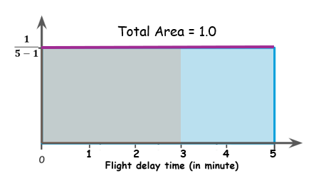
```


<font color = "red">**The Key Observations**</font>

* **The total area (gray + blue) MUST be 1.0**

* The rectangle defined based on the **pre-determined interval [0, 5]** is above the horizontal axis.


With the above figure, we can easily view the probabilities of events defined based on the **flight delay**:

* $P(X = 3) = 0$. This probability corresponds to the area of a degenerate rectangle (i.e., a rectangle with zero width, where the two vertical sides coincide).

* $P(X < 0) = 0$. This is because the height of the degenerated rectangle is 0. 

* $P(X < 3) = P(X < 3) - P(X < 0) =(3-0)\times 0.2 = 0.6$, the area of the gray region (small rectangle inside the big rectangle with total area 1).

* $P(X < 7) = P(X < 5) = P(X < 5)-P(X < 0) = (5-0)\times 0.2 = 1.0$. The total area of the rectangle defined based on [0, 5].


Next, we introduce the formal definition a uniform distribution defined based on a pre-determined interval [a, b] as illustrated in the following figure.


```{r fig.align='center', out.width = '95%'}
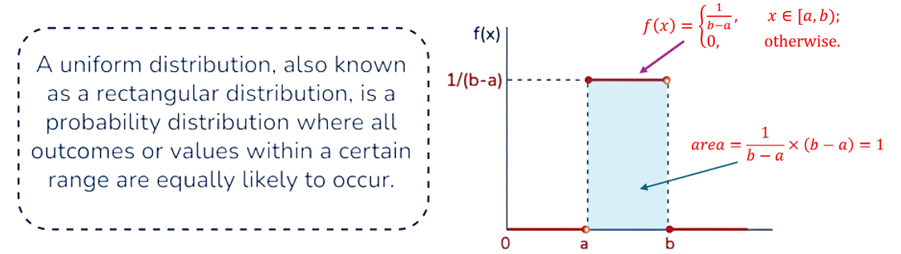
```

The function (in the above figure)

$$
f(x) = \begin{cases}
1/(b-a) & \text{if } x \in (a, b),\\
0  & \text{ Otherwise. }
\end{cases}
$$

is called **probability density function (pdf)** of the uniform random variable $X$.

<font color = "red">

In general, a function $f(x)$ is the probability density function of a random variable $X$, it MUST satisfy two conditions:

1. $f(x) > 0$, the curve must NOT be below the horizontal axis.

2. The area between the curve of $f(x)$ and the horizontal axis MUST be equal to 1.0.

</font>

The above two conditions are analogous to the two fundamental properties of discrete random variables. They are used to test whether a function is the probability density function of a continuous random variable.

**Comments**:

1. The shape of the probability density function (PDF) is determined by the definition of the random variable. For a uniform random variable defined on the interval [a, b], the shape of its density function is a rectangle, as shown in the figure above. By definition, the total area under the rectangle must equal 1.


2. In general, a probability density function is a curve that lies above the horizontal axis. The total area of the region bounded by this curve and the horizontal axis must equal 1.


```{r fig.align='center', out.width = '55%'}
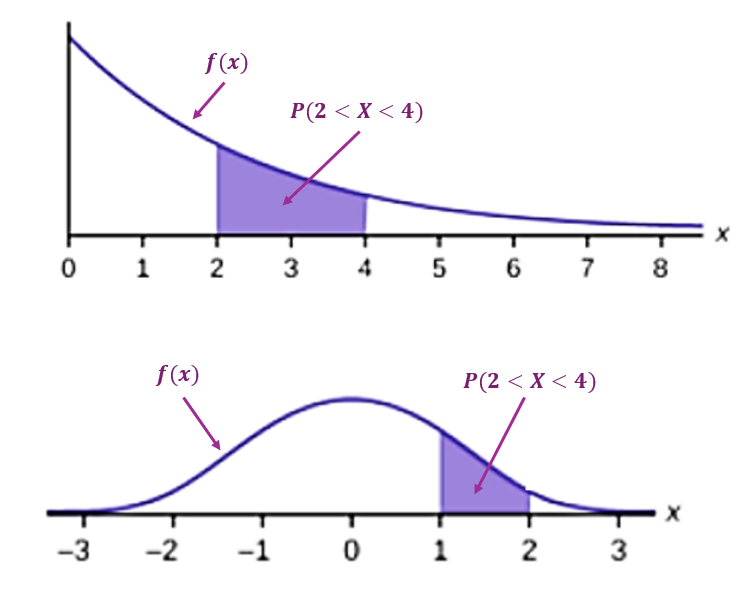
```


## Summary of Discrete and Continuous RVs

We summarize the basics of both discrete and continuous random variables in the following table. 

|  Feature	|   Discrete Random Variable	|   Continuous Random Variable   |
|:----------|:----------------------------|:-------------------------------|
| **Definition**	| Takes on a finite or countably infinite set of distinct values.	| Takes on an uncountably infinite set of values within an interval(s).| 
| **Examples**	| Number of heads in 3 coin flips (0,1,2,3); Roll of a die (1,2,3,4,5,6).	| Height of a person; Time until a light bulb fails; Temperature at noon.| 
| **Probability Model**	| Defined by a Probability Mass Function (PMF), $P(X=x)$.	| Defined by a Probability Density Function (PDF), $f(x)$.| 
| **Fundamental Properties** | (a) $P(X=x) \ge 0$; <br> (b) $\sum_x P(X=x) = 1.0$  | (a) $f(x) \ge 0$; <br> (b) The area bounded by the curve and x-axis is 1. |
| **Visualization**	| Probability histogram (bars).	| Smooth density curve.| 


## Practice Exercises


**Exercise 1**

Classify each of the following random variables as **discrete** or **continuous**.

a) $X$: The number of customers arriving at a bank in an hour.  <br>
b) $Y$: The exact volume of rainwater (in liters) collected in a reservoir in a day.   <br>
c) $Z$: The number of typos found in a 300-page book.   <br>
d) $T$: The time (in seconds) it takes for a computer to complete a specific task.

<font color = "red">**Answers and Hints**</font>

a) Discrete (countable)      <br>
b) Continuous (measurable)   <br>
c) Discrete (countable)      <br>
d) Continuous (measurable)


**Exercise 2**

A discrete random variable $N$ has a probability mass function given by:

$$
P(N = n) = \frac{n}{10}, \quad \text{for } n = 1, 2, 3, 4.
$$

a) Is this a valid PMF? Show your reasoning.   <br>
b) If valid, calculate $P(N \ge 3)$.

<font color = "red">**Answers and Hints**</font>

a) Check if probabilities sum to 1: $0.1 + 0.2 + 0.3 + 0.4 = 1.0$. Yes, it's a valid PMF.  <br> 
b) $P(N \ge 3) = P(3) + P(4) = 0.3 + 0.4 = 0.7$


**Exercise 3**

A continuous random variable $X$ is said to have the pdf:

$$
f(x) = \begin{cases}
kx, & 0 \le x \le 2 \\
0, & \text{otherwise}
\end{cases}
$$

a) What must the value of $k$ be for $f(x)$ to be a valid pdf?   <br>
b) Using your $k$, find $P(0.5 \le X \le 1)$.

<font color = "red">**Answers and Hints**</font>


a) Total area under $f(x)$ must be 1. The area is a triangle: $\frac{1}{2} \times \text{base} \times \text{height} = \frac{1}{2} \times 2 \times (2k) = 2k$. So $2k = 1 \Rightarrow k = 0.5$.   <br>
b) $P(0.5 \le X \le 1)$: Area under line from 0.5 to 1. Calculate using triangle areas:  <br>
   Area from 0 to 1 = $\frac{1}{2} \times 1 \times 0.5 = 0.25$                           <br>
   Area from 0 to 0.5 = $\frac{1}{2} \times 0.5 \times 0.25 = 0.0625$                    <br>
   So area between = $0.25 - 0.0625 = 0.1875$

**Exercise 4**

Let $D$ be a discrete r.v. representing the result of rolling a fair four-sided die (faces: 1, 2, 3, 4). Let $E$ be the event that the roll is a prime number.

a) List the outcomes in $E$.   <br>
b) Find $P(E)$.

<font color = "red">**Answers and Hints**</font>

a) Prime numbers on the die: $\{2, 3\}$   <br>
b) $P(E) = \frac{2}{4} = 0.5$


**Exercise 5**

The daily production time for a factory, $T$, is modeled as a continuous random variable uniformly distributed between 4 hours and 8 hours.

a) What is the total probability "area" under the pdf $f(t)$?   <br>
b) What is the value of the constant pdf $f(t)$ on $[4, 8]$?    <br>
c) Find $P(T \le 6)$ using a simple geometric area calculation.

<font color = "red">**Answers and Hints**</font>

a) Total probability area = 1   <br>
b) Uniform height = $\frac{1}{\text{length}} = \frac{1}{8-4} = \frac{1}{4} = 0.25$  <br> 
c) $P(T \le 6) = \frac{6-4}{8-4} = \frac{2}{4} = 0.5$


**Exercise 6**

A discrete random variable $K$ has the following cumulative distribution function (CDF):

$$
F(k) = P(K \le k) = \begin{cases}
0 & \text{for } k < 1 \\
0.2 & \text{for } 1 \le k < 3 \\
0.7 & \text{for } 3 \le k < 5 \\
1.0 & \text{for } k \ge 5
\end{cases}
$$

a) Find $P(K = 3)$.   <br>
b) Find $P(1 < K \le 4)$.

<font color = "red">**Answers and Hints**</font>


a) $P(K=3) = F(3) - F(\text{just below } 3) = 0.7 - 0.2 = 0.5$   <br>
b) $P(1 < K \le 4) = F(4) - F(1) = 0.7 - 0.2 = 0.5$ (since $F(4) = 0.7$ for $3 \le 4 < 5$)


**Exercise 7**

Which of the following statements is **impossible** for a valid random variable? Explain briefly.

a) A continuous r.v. takes on the specific value 2.5 with probability 0.3.   <br>
b) A discrete r.v. has $P(X=1) = 0.4$ and $P(X=2)=0.6$.                      <br>
c) For a continuous r.v., $P(1 \le X \le 2)$ equals $P(1 < X < 2)$.

<font color = "red">**Answers and Hints**</font>

a) **Impossible**. For a continuous r.v., the probability of any exact value is 0.   <br>
b) Possible. Valid discrete PMF.                                                     <br>
c) Possible. For continuous r.v., probability at a point is 0, so $\le$ and $<$ often give the same result.


**Exercise 8**

A bag contains 4 tokens labeled with the number 1 and 6 tokens labeled with the number 2. One token is drawn at random. Let $V$ be its value.

a) Specify the PMF for $V$.   <br>
b) Find the probability that $V = 1$ given that $V \le 1.5$.

<font color = "red">**Answers and Hints**</font>


a) $P(V=1)=0.4$, $P(V=2)=0.6$   <br>
b) From the definition of conditional probability, $P(V=1|V \le 1.5) =P(V=1 \cap V\le 1.5)/P(V \le 1.5) = P(V=1)/P(V \le 1.5) = 0.4/0.4 = 1$.


**Exercise 9**

A continuous random variable $U$ is uniformly distributed on the interval $[0, 10]$.

a) Find $P(U > 7)$.   <br>
b) Find $P(U > 7 \mid U > 4)$ using logic and ratio of lengths.

<font color = "red">**Answers and Hints**</font>


a) $P(U > 7) = \frac{10-7}{10-0} = \frac{3}{10} = 0.3$  <br> 
b) $P(U > 7 \mid U > 4) = \frac{P(U > 7)}{P(U > 4)} = \frac{0.3}{0.6} = 0.5$


**Exercise 10**

A continuous r.v. $X$ has a pdf shaped like a right triangle on the interval $[0, 2]$. The pdf decreases linearly from a height $h$ at $x=0$ to $0$ at $x=2$.

a) Sketch this pdf. What is the total area of this triangle?       <br>
b) Using the area formula for a triangle, find the value of $h$.   <br>
c) Find $P(X < 1)$.


<font color = "red">**Answers and Hints**</font>

a) Triangle with base 2, height $h$. Area = $\frac{1}{2} \times 2 \times h = h$, and this must equal 1.   <br>
b) From (a), $h = 1$   <br>
c) The pdf equation is $f(x) = 1 - 0.5x$ for $0 \le x \le 2$. Find area from 0 to 1: trapezoid with bases $f(0)=1$ and $f(1)=0.5$, height 1: $P = \frac{(1+0.5)}{2} \times 1 = 0.75$


