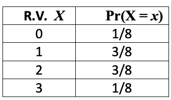

```{css echo = FALSE}

<style type="text/css">

div#TOC li {
    list-style:none;
    background-image:none;
    background-repeat:none;
    background-position:0;
}

/* Cascading Style Sheets (CSS) is a stylesheet language used to describe the presentation of a document written in HTML or XML. it is a simple mechanism for adding style (e.g., fonts, colors, spacing) to Web documents. */

h1.title {  /* Title - font specifications of the report title */
  font-size: 22px;
  font-weight: bold;
  color: navy;
  text-align: center;
  font-family: "Gill Sans", sans-serif;
}
h4.author { /* Header 4 - font specifications for authors  */
  font-size: 18px;
  font-weight: bold;
  font-family: system-ui;
  color: navy;
  text-align: center;
}
h4.date { /* Header 4 - font specifications for the date  */
  font-size: 18px;
  font-family: system-ui;
  color: DarkBlue;
  text-align: center;
  font-weight: bold;
}
h1 { /* Header 1 - font specifications for level 1 section title  */
    font-size: 18px;
    font-family: "Gill Sans", sans-serif;
    color: navy;
    text-align: center;
    font-weight: bold;
}
h2 { /* Header 2 - font specifications for level 2 section title */
    font-size: 16px;
    font-family: "Gill Sans", sans-serif;
    color: navy;
    text-align: left;
    font-weight: bold;
}

h3 { /* Header 3 - font specifications of level 3 section title  */
    font-size: 14px;
    font-family: "Gill Sans", sans-serif;
    color: navy;
    text-align: left;
}

h4 { /* Header 4 - font specifications of level 4 section title  */
    font-size: 12px;
    font-family: "Gill Sans", sans-serif;
    color: darkred;
    text-align: left;
}

body { background-color:white; }

.highlightme { background-color:yellow; }

p { background-color:white; }

</style>
```


```{r setup, include=FALSE}
# code chunk specifies whether the R code, warnings, and output 
# will be included in the output files.
if(!require('vembedr')) {
  install.packages('vembedr')
  library('vembedr')
}
if (!require("knitr")) {
   install.packages("knitr")
   library(knitr)
}
# knitr::opts_knit$set(root.dir = "C:/Users/75CPENG/OneDrive - West Chester University of PA/Documents")
# knitr::opts_knit$set(root.dir = "C:\\STA490\\w05")

knitr::opts_chunk$set(echo = FALSE,       
                      warning = FALSE,   
                      results = TRUE,   
                      message = FALSE,
                      comment = FALSE)
```


\

# Definition and Basic Concepts


**A Discrete Random Variable** can only take specific, separate values (like integers). Think of counting things: number of heads when flipping coins, number of customers in a store, etc.


In the last note, we introduced three methods—the probability distribution histogram, the probability distribution table, and the probability mass (or distribution) function—for characterizing discrete random variables.

Recall that the probability mass function (PMF), denoted by, $p_X(x)$, gives the probability that the random variable $X$ (<font color = "red">*uppercase letters denote random variables*</font>) takes the value  $x$ (<font color = "red">*lowercase letters denote observed values of the corresponding random variables*</font>).

$$
P(X = x) = p_X(x)
$$


Two important rules:

1. $p(x) \geq 0$ for all possible $x$ <br>

2. $\sum_{\text{all } x} p(x) = 1$ (All probabilities add up to 1)


## Cumulative Distribution


The **Cumulative Distribution Function** gives the probability that $X$ is less than or equal to a certain value:

$$
F(x) = P(X \leq x) = \sum_{k \leq x} p(k)
$$

Consider the following distribution table of the random variable $X$ = number of boys in a randomly selected family with 3 children.

```{r fig.align='center', out.width="35%"}

```  
       
       
The cumulative probability $P(X \le 2.5)$ is calculated in the following:
       
$$
F(2.5) = P(X\le 2.5) = P(X = 0) + P(X = 1) + P(X = 2) = 1/8 + 3/8 + 3/8 = 7/8.
$$


## Expectation

The **expected value** or **mean** is like the **average outcome** we'd expect if we could repeat an experiment many times. For example, if we roll a **fair** 4-sided die with faces labeled 0, 1, 2, and 3, and each face is **equally likely** to be observed, the average result after many rolls is $(0 + 1 + 2 + 3)/4 = 1.5$.

However, if we roll an **unfair** 4-sided die with faces labeled 0, 1, 2, and 3, then each face is **not equally likely** to be observed. In this case, the average is not simply $(0 + 1 + 2 + 3)/4 = 1.5$.


The **Expectation** of a (discrete) random variable $X$, denoted $E[X]$, is the weighted average of its values. The weights are determined by the probability that the corresponding value is observed. The formal definition is given by

$$
E[X] = \sum_x x\times P(X = x).
$$

**Example (Gender of Children example revisited)**: sing the distribution table above, the average number of boys in families with 3 children can be calculated by

$$
E[X] = \sum_x x\times P(X = x) = 0\times (1/8) + 1 \times (3/8) + 2\times (3/8) + 3\times (1/8) = 12/8 = 1.5.
$$

## Variance and Standard Deviation

**Variance** measures how spread out the values are from the mean. It's the average squared distance from the mean. For a discrete random variable, variance is simply the weighted average of squared deviations. The following is the explicit expression of the variance formula

$$
\text{var}(X) = \sigma^2 = E[(X - \mu)^2] = \sum_{\text{all } x} (x - \mu)^2 \cdot P(X=x)
$$

The standard deviation of a discrete random variable is the square root of the variance which is given by

$$
\text{stdev}(X) = \sqrt{\sigma^2} = \sqrt{E[(X - \mu)^2]} = \sqrt{\sum_{\text{all } x} (x - \mu)^2 \cdot P(X=x)}
$$

Let revisit **the gender of children** example. $X =$ the number boys of a random selected family with 3 children. Based on the above distribution table and $E[X] = 1.5 = 3/2$,  we have

$$
\sigma^2 = \text{var}(X) = (0-3/2)^2 \times (1/8) + (1-3/2)^2\times (3/8) + (2-3/2)^2\times (3/8) + (3-3/2)^2\times (1/8)
$$

$$
 = \frac{9}{4}\times\frac{1}{8} + \frac{1}{4}\times\frac{3}{8} + \frac{1}{4}\times\frac{3}{8} + \frac{9}{4}\times\frac{1}{8} = \frac{9}{32} +  \frac{3}{32} + \frac{3}{32} + \frac{9}{32} = \frac{24}{32} =\frac{3}{4} = 0.75.
$$

The standard deviation of $X$ is $\sigma = \sqrt{3/4} = \sqrt{3}/2 \approx 0.866$.


In the next two sections, we discuss two special discrete random variables that  are commonly used in practice.

\

# Binomial Distribution

Before introducing binomial distribution, we first outline a simple special **binary** random variable: **Bernoulli Random Variable**.

## Bernoulli Trial

A **Bernoulli trial** (named after Swiss mathematician Jacob Bernoulli, 1654-1705) is the simplest possible random experiment with exactly two outcomes (e.g., binary outcome).

**Key Characteristics**:

1. **Binary Outcome**: Only two possible results (Success/Failure, Yes/No, 1/0)

2. **Constant Probability**: Probability of success ($p$) remains the same for each trial

3. **Independence**: Outcome of one trial doesn't affect others

4. **Identical Distribution**: All trials follow the same Bernoulli($p$) distribution


**Real-World Examples**:

- Coin flip (Heads = Success, Tails = Failure; if the coin is fair, $p = 0.5$)

- Quality testing (Defective = Failure, Non-defective = Success)

- Medical test (Positive = Success, Negative = Failure)

- Survey response (Yes = Success, No = Failure)


**Bernoulli Random Variable Definition**


A <font color = "red">**Bernoulli random variable $X$**</font>  is defined as:

$$
X = \begin{cases}
1 & \text{with probability } p \quad (\text{success}) \\
0 & \text{with probability } 1-p = q \quad (\text{failure})
\end{cases}
$$

**Notation:** $X \sim \text{Bernoulli}(p)$ or $X \sim \text{Bern}(p)$


**Distribution Characterization**

The following **probability mass function** is given by

$$
P(X = x) = \begin{cases}
p & \text{if } x = 1; \\
1-p & \text{if } x = 0. 
\end{cases}
$$

**Expectation (Mean) and Variance**

The expectation of Bernoulli($p$) is given by

$$
E[X] = \sum_{x=0}^1 x \cdot P(X = x) = 0 \cdot (1-p) + 1 \cdot p = p.
$$

The variance is given by

$$
\text{Var}(X) = \sum_{x=0}^1 (x-p)^2 \cdot P(X = x) =(0-p)^2 \times(1-p) + (1-p)^2 \times p= p - p^2 = p(1-p)
$$

## Binomial Distribution

We will following the same three steps to discuss the binomial distribution and its properties.

<font color = "blue">**Definition**</font>

The **binomial distribution** is a discrete probability distribution that models the number of successes in a **fixed** number of **independent** **Bernoulli trials**, each with the **same** probability of success.

If a random variable $X$ follows a binomial distribution, we write:

$$
X \sim \text{Bin}(n, p)
$$
where:

- $n$ = number of trials

- $p$ = probability of success on each trial

\

<font color = "blue">**Probability Mass Function**</font>


The probability mass function (PMF) is given by:

$$
P(X = k) = \binom{n}{k} p^k (1-p)^{n-k}, \quad k = 0, 1, 2, \dots, n
$$

where $\binom{n}{k} = \frac{n!}{k!(n-k)!}$ is the binomial coefficient. for a positive integer m, $m! = m\times (m-1)\times (m-2)\times \cdots \times 3\times 2\times 1$ and $0! = 1$.

For a binomial distribution to be appropriate, the following conditions must be satisfied:

1. **Fixed number of trials ($n$)** - The experiment consists of a predetermined number $n$ of identical trials.

2. **Binary outcomes** - Each trial results in one of two mutually exclusive outcomes: *success* or *failure*.

3. **Constant probability ($p$)** - The probability of success $p$ remains constant for each trial.

4. **Independence** - The trials are statistically independent of each other.

5. **Discrete count** - The random variable $X$ counts the number of successes in $n$ trials.

\

<font color = "blue">**Expectation and Variance**</font>


We will not derive the formulas for expectation and variance of binomial random variable. Instead, we give the formula directly in the following

* **Expectation**: $E[X] = np$

* **Variance**: $\text{Var}(X) = np(1-p)$

<font color = "red">**Caution**</font>: The above formulas are true only for the binomial random variable with $n$ independent binary trials with success probability $p$.

\

**Example 1: Quality Control in Manufacturing**: A factory produces light bulbs, and historically 4% of them are defective. The quality control department randomly selects 25 light bulbs from the production line for testing.

1. What is the probability that exactly 2 bulbs are defective?

2. What is the probability that at most 1 bulb is defective?

3. What is the probability that at least 3 bulbs are defective?

4. What are the expected number and standard deviation of defective bulbs?

<font color = "red">**Solution**:</font>

The probability mass function is

$$
P(X = x) = \binom{25}{x} 0.04^x (1-0.04)^{25-x}
$$
1.  $P(X = 2) =\binom{25}{2} 0.04^2 (1-0.04)^{25-2}$. Note that

$$
\binom{25}{2} = \frac{25!}{2!(25-2)!} = \frac{25\times 24}{2\times 1} = 300.
$$

Therefore,

$$
P(X =2) = 300\times 0.04^2\times 0.96^{23} = 0.1877066
$$
2.  **at most 1** means $P(X \le 1) = P(X = 0) + P(X = 1)$, note that


$$
P(X = 0) = \binom{25}{0}0.04^0\times 0.96^{25} = 1\times 1 \times 0.96^{25} = 0.3603967
$$

$$
P(X = 1) = \binom{25}{1}0.04^1\times 0.96^{25-1} = 25\times 0.04 \times 0.96^{24} = 0.3754132
$$

Therefore,

$$
P(X \le 1) = P(X = 0) + P(X = 1) = 0.3603967 + 0.3754132 = 0.73581.
$$
3.  **at least 3** means $\ge 3$. Note that $P(X \ge 3) = 1 - P(X \le 2)$. We have calculate $P(X = 0), P(X = 1)$, and $P(X = 2)$ previously. Therefore,


$$
P(X \ge 3) = 1 - P(X \le 2) = 1 -[P(X=0) + P(X = 1) + P(X =2)] = 1 - (0.3603967 + 0.3754132 + 0.1877066) = 0.0764835
$$
4.  The expected value and standard deviation of defective bulbs are

$$
E[X] = np = 25\times 0.04 = 1 \ \ \text{ and } \ \ \sqrt{\text{var}(X)} = \sqrt{np(1-p)} = \sqrt{1\times 0.96} = 0.9798.
$$


**Example 2 -  Customer Service Call Center**: A call center knows that 60% of customers will be satisfied with their service. On a particular day, they receive 20 customer feedback calls.

**Questions**:

1. What is the probability that exactly 15 customers are satisfied? <font color = "red">[answer: 0.074647]</font>

2. What is the probability that more than 18 customers are satisfied? <font color = "red">[answer: 0.00052405]</font>


# Poisson Distribution

The **Poisson distribution** is a discrete probability distribution that models the number of events occurring in a (pre-determined) **fixed interval** of time or space, when these events occur with a known **constant mean rate** (depending on the width of the interval) and independently of the time since the last event.

**Key Assumptions**

1. Events occur **independently**

2. Average rate ($\lambda$) is **constant** which is dependent on the width of the fixed interval.

3. **Two events cannot occur at exactly the same instant**

4. Probability of an event in a small interval is proportional to interval length

\

We follow the 3-step description of discrete random variables for Poisson:

\

<font color = "blue">**Definition**</font>


Let $X =$ the number of events occurring in a (pre-determined) **fixed interval** of time or space.


<font color = "blue">**Probability Mass Function**</font>

$$
P(X = k) = \frac{\lambda^k e^{-\lambda}}{k!}
$$

where:

- $k$ = number of events ($k = 0, 1, 2, ... ). <font color = "red">[There is no cap for k!]</font>
- $\lambda$ = average rate of events (i.e., the expected value of $X$)
- $e$ ≈ 2.71828 (Euler's number)

\

<font color = "red">**Caution**: The expected value of Poisson $\lambda$ is dependent on the interval in the definition. If the interval in the definition of the Poisson random variable is different from the interval in the question, the expected value needs to be adjusted according to the interval in the question before calculate the appropriate probabilities.</font>


\

**Example 3 - Call Center Operations**: A call center receives an average of 5 calls per hour during their peak period. 
What is the probability that in a given hour they will receive:

a) Exactly 3 calls?

b) At most 2 calls?

c) At least 4 calls?

<font color = "red">**Solution**</font>: Given that λ = 5 calls per hour (mean rate). The Poisson probability mass function is:

$$
P(X = k) = \frac{e^{-\lambda} \lambda^k}{k!}
$$

a) Probability of exactly 3 calls:

$$
\begin{aligned}
P(X = 3) &= \frac{e^{-5} \cdot 5^3}{3!} \\
&= \frac{e^{-5} \cdot 125}{6} \\
&= \frac{0.006737947 \cdot 125}{6} \\
&= \frac{0.842243375}{6} \\
&\approx 0.1404
\end{aligned}
$$

b) Probability of at most 2 calls:

$$
\begin{aligned}
P(X \leq 2) &= P(X = 0) + P(X = 1) + P(X = 2) \\
P(X = 0) &= \frac{e^{-5} \cdot 5^0}{0!} = e^{-5} \approx 0.00674 \\
P(X = 1) &= \frac{e^{-5} \cdot 5^1}{1!} = 5e^{-5} \approx 0.03369 \\
P(X = 2) &= \frac{e^{-5} \cdot 5^2}{2!} = \frac{25e^{-5}}{2} \approx 0.08422 \\
P(X \leq 2) &\approx 0.00674 + 0.03369 + 0.08422 \approx 0.12465
\end{aligned}
$$


c) Probability of at least 4 calls:

$$
\begin{aligned}
P(X \geq 4) &= 1 - P(X \leq 3) \\
P(X \leq 3) &= P(X \leq 2) + P(X = 3) \\
&\approx 0.12465 + 0.14037 = 0.26502 \\
P(X \geq 4) &\approx 1 - 0.26502 = 0.73498
\end{aligned}
$$


**Example 4- Hospital Emergency Room**: An emergency room receives an average of 4 patients per hour between 
10 PM and 6 AM. What is the probability that during a 30-minute period:

a) No patients arrive?

b) Exactly 3 patients arrive?

c) At least 2 patients arrive?


<font color = "red">**Solution**</font>: <font color="blue">**Adjust $\lambda$ for 30 minutes. If $\lambda = 4$ patients per hour, then for 30 minutes**:

$$
\lambda_{30min} = 4 \times \frac{30}{60} = 2 \text{ patients per 30 minutes}
$$
</font>


a) Probability of no patients:

$$
P(X = 0) = \frac{e^{-2} \cdot 2^0}{0!} = e^{-2} \approx 0.13534
$$


b) Probability of exactly 3 patients:

$$
\begin{aligned}
P(X = 3) &= \frac{e^{-2} \cdot 2^3}{3!} = \frac{e^{-2} \cdot 8}{6} \\
&\approx \frac{0.13534 \times 8}{6} = \frac{1.08272}{6} \approx 0.18045
\end{aligned}
$$


c) Probability of at least 2 patients:

$$
\begin{aligned}
P(X \geq 2) &= 1 - [P(X = 0) + P(X = 1)] \\
P(X = 1) &= \frac{e^{-2} \cdot 2^1}{1!} = 2e^{-2} \approx 0.27067 \\
P(X = 0) + P(X = 1) &\approx 0.13534 + 0.27067 = 0.40601 \\
P(X \geq 2) &\approx 1 - 0.40601 = 0.59399
\end{aligned}
$$


# Comparison between Binomial and Poisson

\

| Characteristic	| Binomial Distribution	| Poisson Distribution |
|:----------------|:----------------------|:---------------------|
| Number of trials	| Fixed number $n$	| Potentially infinite| 
| Nature of events	| Independent trials	| Independent events in continuous interval| 
| Success probability	| Constant $p$	| Event rate λ per unit time/space| 
| Variance	| $np(1-p) < np$ (for $p>0$)	| $λ = $ mean| 
| Range	| $k = 0, 1, 2, \dots, n$ (<font color = "red">**finite**</font>)	| $k = 0, 1, 2, \dots$ (<font color = "red">**infinite**</font>)| 
| Typical scenarios	| Coin tosses, quality control, yes/no surveys	| Rare events, arrivals, defects in continuous processes| 


