```{js echo=FALSE}
let mainNav=document.getElementById("js-menu");
        let navBarToggle=document.getElementById("js-navbar-toggle");
        navBarToggle.addEventListener("click",function(){mainNav.classList.toggle("active")});

function toggle_visibility(b){
     var a=document.getElementById(b);
     if(a.style.display=="block"){a.style.display="none"}else{a.style.display="block"}}

window.dataLayer=window.dataLayer||[];

function gtag(){dataLayer.push(arguments)}

gtag("js",new Date());

gtag("config","UA-122097904-1");

(adsbygoogle=window.adsbygoogle||[]).push({google_ad_client:"ca-pub-5912385878283070",enable_page_level_ads:true});

```


```{css echo= FALSE}

<style type="text/css">

div#TOC li {
    list-style:none;
    background-image:none;
    background-repeat:none;
    background-position:0;
}
h1.title {
  font-size: 24px;
  color: DarkRed;
  text-align: center;
}
h4.author { /* Header 4 - and the author and data headers use this too  */
    font-size: 18px;
  font-family: "Times New Roman", Times, serif;
  color: DarkRed;
  text-align: center;
}
h4.date { /* Header 4 - and the author and data headers use this too  */
  font-size: 18px;
  font-family: "Times New Roman", Times, serif;
  color: DarkBlue;
  text-align: center;
}

h1 { /* Header 3 - and the author and data headers use this too  */
    font-size: 20px;
    font-family: "Times New Roman", Times, serif;
    color: darkred;
    text-align: center;
}
h2 { /* Header 3 - and the author and data headers use this too  */
    font-size: 18px;
    font-family: "Times New Roman", Times, serif;
    color: navy;
    text-align: left;
}

h3 { /* Header 3 - and the author and data headers use this too  */
    font-size: 16px;
    font-family: "Times New Roman", Times, serif;
    color: navy;
    text-align: left;
}

</style>
```


```{r setup, include=FALSE}
if(!require('vembedr')) {
  install.packages('vembedr')
  library('vembedr')
}
if (!require("knitr")) {
   install.packages("knitr")
   library(knitr)
}
if (!require("plotly")) {
   install.packages("plotly")
   library(plotly)
}
# knitr::opts_knit$set(root.dir = "C:/Users/75CPENG/OneDrive - West Chester University of PA/Documents")
# knitr::opts_knit$set(root.dir = "C:\\STA490\\w05")

knitr::opts_chunk$set(echo = FALSE,       
                      warning = FALSE,   
                      results = TRUE,   
                      message = FALSE,
                      comment = NA)
```


\

# Introduction

We have introduced a very special and simple continuous random variable. uniform random variable and its probability distribution with density function

$$
f(x) = \begin{cases}
\frac{1}{b-a}, & a \le x \le b; \\
0, & \text{otherwise}.
\end{cases}
$$

The fact that its density function is a simple rectangle means that probability problems can be addressed by calculating areas of sub-rectangles. This demonstrates two fundamental properties of continuous distributions (see the left panel in the following figure).


1. $f(x) \ge 0$

2. The area of the region bounded by $f(x)$ and x-axis must equal to 1.


We also defined the probability of event $a \le x \le b$ to be area of the sub-region (the right panel of the following figure).

```{r fig.align='center', out.width="80%"}
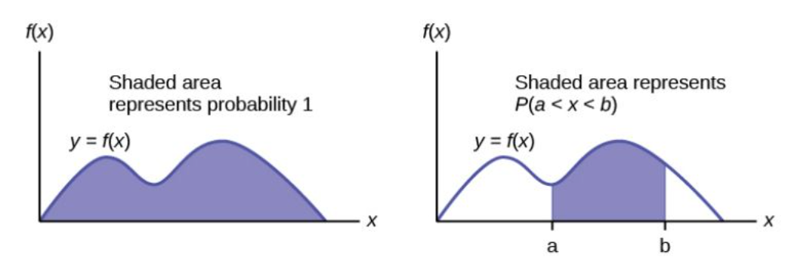
```


Because they involve calculus, we will not cover the general formulas for expected value and variance in this course; we will, **however, introduce and apply the specific formulas for important continuous distributions**. Our goal is to learn how to use these formulas in practical applications.

\
**Two Types of Questions Frequently Addressed in Applications**

a). Finding probability P( a \le X \le b) if $a$ and $b$ are given. If $a = b$, $P(X = a) = 0$.

b). Finding $a$ if $b$ and $p_0 = P(a \le X \le b)$ are given. Note that, $a$ could be $-\infty$ and $b$ could be $\infty$. If $a = -\infty$ and $P(-\infty < X \le b) = p_0$, $b$ is $100p_0$-th percentile (*also called quantile*).

\

Next, we discuss special continuous random variables such as standard normal distribution, general normal distributions and a simple asymmetric exponential distributions. We primarily focus on the above two types of questions when we discuss normal distributions in the subsequent sections.

\

# Standard Normal Distribution

The standard normal distribution, $Z$, has a mean of $\mu = 0$  and a standard deviation of  $\sigma = 1$. Its probability density curve is

```{r fig.align='center', out.width="60%"}
include_graphics("week04/z-Dist.png")
```


Two basic types of questions need to be answered for any distribution including the standard normal distribution:

1. Finding probability of events such as P(Z < a), P(Z > c), P( a < Z < b), etc.

2. Finding percentiles. For example, finding $z_0$ for given P(Z < $z_0$) = 0.90.

We have discussed how to find probabilities from the uniform distribution in topic #3 whose density curve is a rectangle. The probabilities of events defined based on uniform distributions are the areas of rectangles using the area formula of a rectangle. We still need to find the probability of events defined based on the standard normal distribution like P($-0.86 < Z < 0$) which is still the area of the following shaded region (as outlined in the previous note for any general distribution).

```{r fig.align='center', out.width="60%"}
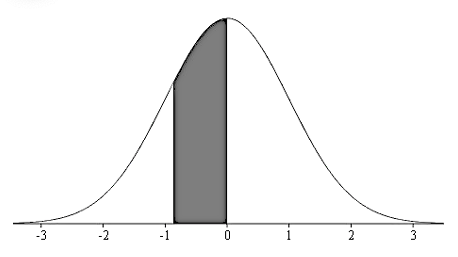
```


\

## Finding Probabilities 

Unlike uniform distributions whose density curves are rectangles, we can use the formula to calculate the areas of rectangles. In a standard normal distribution, there is no formula to calculate the area of the shaded irregular region in the above figure. 

We will use a standard normal distribution table to find the area of the left-hand side tail regions shown below (part of the table).


```{r fig.align='center', out.width="99%"}
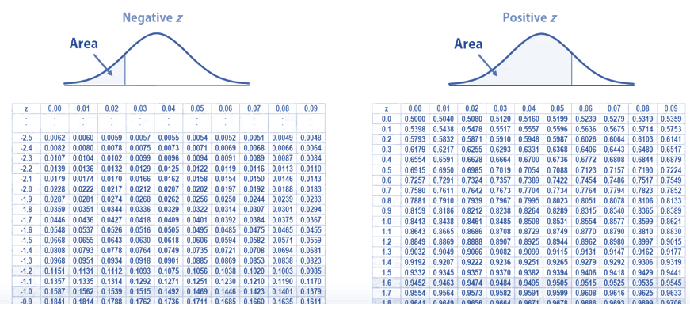
```


Before doing examples, we point out the basic facts of the standard normal distribution.

1. The density curve is symmetric concerning the vertical axis.

2. The area between the curve and the horizontal axis is equal to 1. This means that the areas of the left and right regions are equal to 0.5.

Next, we use several examples to illustrate how to use the standard normal table to find the areas of different regions defined based on the standard normal distribution.


<font color = "darkred"><b>Example 1.</b></font> Find the probabilities indicated, where as always Z denotes a standard normal random variable.

1). P(Z < - 1.48).

2). P(Z < 0.25).

**Solution**. First of all, we only keep two decimal places for the z value (also called z-score). When using the table, we first locate the integral part and the first decimal place of the z score in the **first column** and the second decimal place in the **top row**. The **left tail area** is on the interaction of the aforementioned row and column. This is explained in the following figure.

```{r fig.align='center', out.width="99%"}
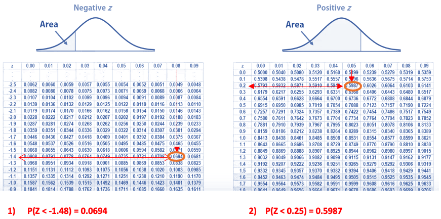
```


<font color = "darkred"><b>Example 2.</b></font> Find the probabilities indicated, where as always Z denotes a standard normal random variable.

1). P(Z > - 1.96).

2). P(Z > 0.75).

**Solution**: The probabilities to be found represent the areas of right tail regions. We can use the table to find the area of the left tail region and then subtract it from 1 to get the desired probability. The following figure illustrates the idea to get the "right-tail" probabilities.


```{r fig.align='center', out.width="99%"}
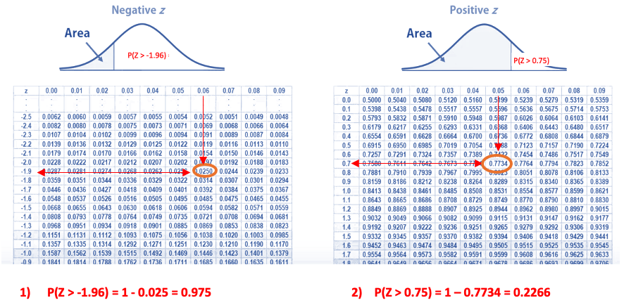
```


<font color = "darkred"><b>Example 3.</b></font> Find the probabilities indicated, where as always Z denotes a standard normal random variable.

1). P(-1.96 < Z < 0.75).

**Solution**: The general idea is to find the two **left tail areas** and then take the difference to get the area of the region defined by the two z-scores as shown in the following figure.


```{r fig.align='center', out.width="79%"}
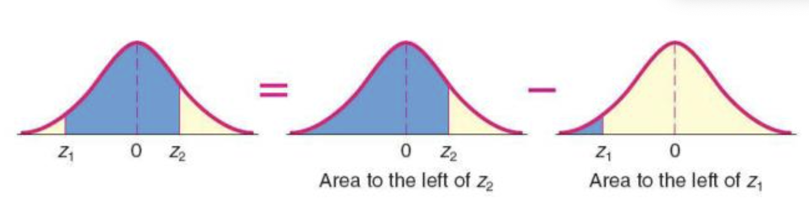
```


For 1), the probability is found in the following figure.

```{r fig.align='center', out.width="99%"}
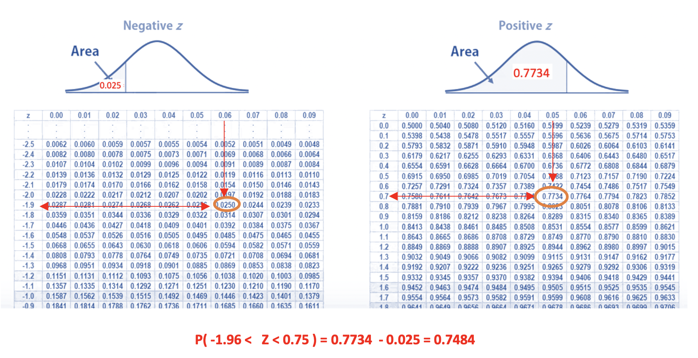
```


**Summary of Finding Probabilities**

\

```{r fig.align='center', out.width="99%"}
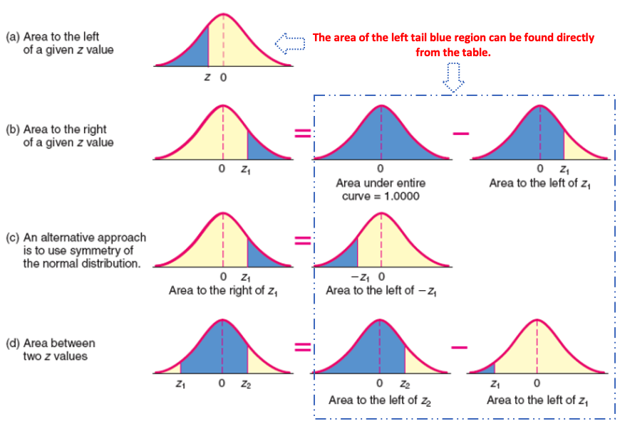
```


## Finding Percentiles

We have introduced how to find a percentile from a given data set. We basically do the same thing for the standard normal distribution.

Recall that the q-the percentile is the cut-off value such that 100q% data values are less than or equal to the cut-off value (q-th percentile). This means, we find a percentile, and the left tail area is always given. The general formulation of the problem is to find the cut-off k that satisfies 

$$
P(Z < k) = 0.90,
$$

for a given q (such as 90%, etc).  This is depicted in the following figure.

```{r fig.align='center', out.width="59%"}
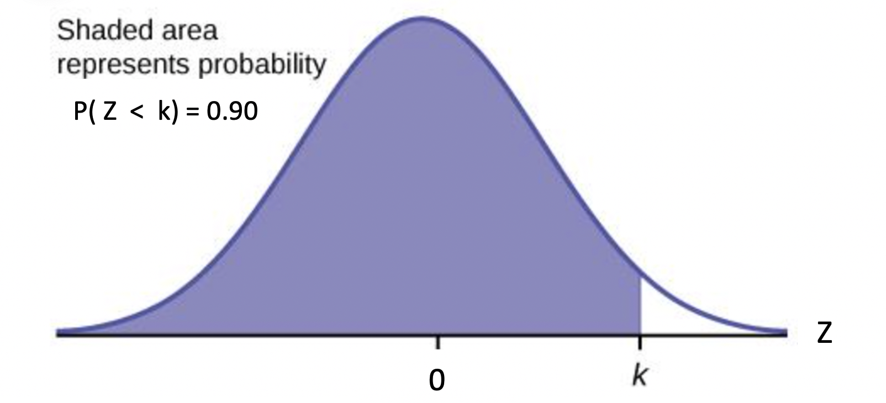
```


The process of finding a percentile is the opposite of the process of finding probability. If the given left tail probability itself is in the main body of the table, we then locate the row and the column to find the z-score (i.e., the percentile). 

In general, the given left tail probability is not in the table but is closest to two values in the main boy of the table. Each of the two closed table values corresponds to a z-score. The average of the two z-scores is defined to be the desired percentile.


<font color = "darkred"><b>Example 4.</b></font> Find 90th percentile of the standard normal distribution.

**Solution**: We go to the normal table and find two values in the main body of the table that is closest to 0.9 (see the figure below).

```{r fig.align='center', out.width="89%"}
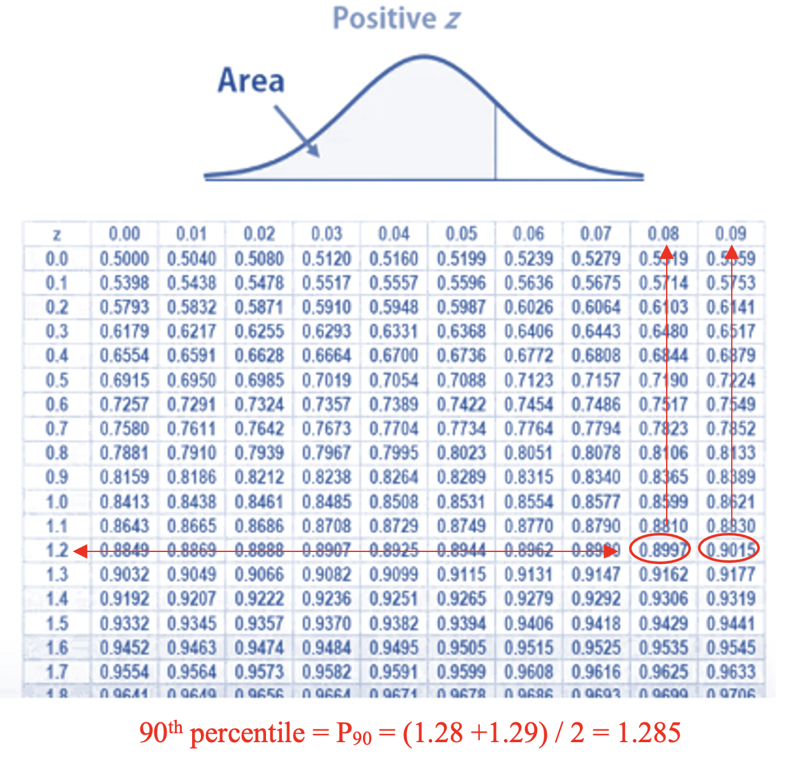
```


\


<font color = "darkred"><b>Example 5.</b></font> **The Precision Scientific Instrument Company** manufactures thermometers that are supposed to give readings of $0^oC$ at the freezing point of water. Tests on a large sample of these instruments reveal that the freezing point of water is around zero (some thermometers give positive degrees, some thermometers give negative degrees), Assume that the mean reading is $0^oC$ and the standard deviation of the readings is $1.00^oC$. Assume further that the readings are normally distributed. 

1.	Find the probability that, at the freezing point of water, the reading is between $0^oC$ and $1.58^oC$.

2.	Find the probability that the reading is between $–2.43^oC$ and $0^oC$.

3.	Find the probability that the reading is between $0.5^oC$ and $2.5^oC$.

4.	Find the probability that the reading is between $–1^oC$ and $–2.5^oC$.

5.	Find the probability that the reading is between $–1.5^oC$ and $1^oC$.

6.	Find the probability that the reading is exactly $0^oC$.

7.	Find the temperature z corresponding to $P_{95}$, the 95th percentile (95% of the readings less than z and 5% of the readings are greater than z).

8.	Fin the 10th percentile.

**Solution**: Based on the given information, the thermometer readings follow the standard normal distribution. The standard normal distribution table will be used to answer the above questions. We only do questions 5 (finding probability) and 7 (finding percentile) to work and leave the rest of the questions to you to practice.

5). <font color = "red">P( -1.5 < Z < 0) = P(Z < 0) - P(Z < -1.5) = 0.5 - P(Z < -1.5) = 0.5 - 0.0668 = 0.4332 </font>

```{r fig.align='center', out.width="79%"}
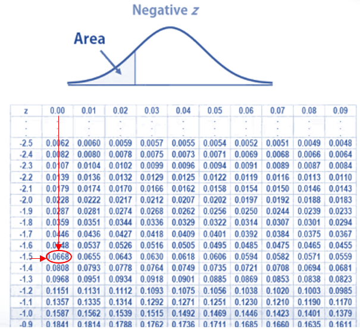
```


7). We want to find $P_{95}$, or equivalently, to find $k$ from $P(Z < k) = 0.95$. We can see from the normal table that 0.9495 and 0.9505 are the two values that are closest to 0.95. The two corresponding z-scores are 1.64 and 1.65. By the convention, the 95th percentile is the average of the two z-scores (see the figure below).

```{r fig.align='center', out.width="79%"}
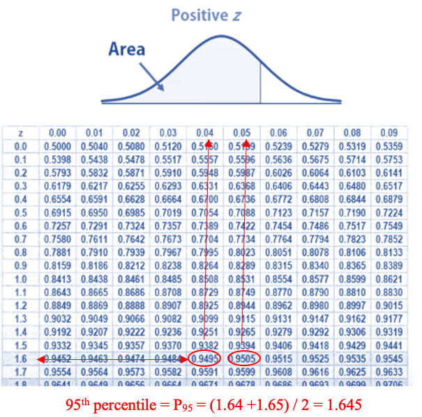
```


\

# General Normal Distribution

\

In practice, we rarely have a standard normal distribution. Many real-world problems are associated with general normal distribution. We still need to answer the two basic types of questions: finding probabilities and percentile. The following figure illustrates the two types of questions based on the normal distribution with a mean of 500 ($\mu = 500$) and a standard deviation of 100 ($\sigma = 100$)

```{r fig.align='center', out.width="89%"}
include_graphics("week04/twoTypeQuestions.png")
```


The question is whether we cannot use the standard normal distribution table to answer the above two types of questions associated with general normal distribution. 

We can use z-score transformation to transform general normal distributions to the standard normal distribution to use the table and then transform back the original general normal distribution. The following figure outlines the above idea.

```{r fig.align='center', out.width="89%"}
include_graphics("week04/z-ScoreTranform.png")
```


## Finding Probabilities

We use the following example to show the steps for finding the left-tail probabilities.

<font color = "darkred"><b>Example 6.</b></font> Consider the general normal distribution $N(500, 100)$. Find $P(X < 600) = ?$


**Solution**. The following figure shows the z-score transformation to obtain the answer.

```{r fig.align='center', out.width="59%"}
include_graphics("week04/example06.png")
```


## Finding Percentiles

We continue to use the previous normal distribution as an example to show how to find a percentile of the general normal distribution.

<font color = "darkred"><b>Example 7.</b></font> Consider the general normal distribution $N(500, 100)$. Find the 15th percentile.


**Solution: ** We are given that the left tail area is 0.15.  After z-score transformation, the left tail area of the standard normal density curve is also 0.15 (see the following figure). We can find $Z_0$ from $P(Z < Z_0) = 0.15$ using the standard normal table which is $Z_0 \approx -1.04$.

```{r fig.align='center', out.width="69%"}
include_graphics("week04/example07.png")
```


Using the relationship between $Z_0$ and $K$ in the z-score transformation (see the above figure). We have

$$
-1.04 = \frac{K - 500}{100}
$$
Solve for $K$, we have $K = 500 - 1.04\times 100 = 396$.


<font color = "darkred"><b>Example 8.</b></font>	Tomkins Associates reports that the mean clear height for a Class A warehouse in the United States is 22 feet. Suppose clear heights are normally distributed and that the standard deviation is 4 feet. A Class A warehouse in the United States is randomly selected

a). What is the probability that the clear height is greater than 17 feet?

b). What is the probability that the clear height is less than 13 feet?

c). What is the probability that the clear height is between 25 and 31 feet?    

d). Find the clear height such that 10% of all clear heights are less than it.

**Solution** The following figures outline the process of finding the answers to each of the questions.

a). P(X > 17) = P(Z > -5/4) = 1 - P(Z < -5/4) = 0.8944.

\

```{r fig.align='center', out.width="89%"}
include_graphics("week04/example08a.png")
```


b). P(X < 13) = P(Z < 9/4) = 0.012.

\

```{r fig.align='center', out.width="89%"}
include_graphics("week04/example08b.png")
```


c). P(25 < X  31) = P(3/4 < Z < 9/4) = P(Z < 9/4) - P(Z < 3/4) = 0.9878 - 0.9734 = 0.2144.

\

```{r fig.align='center', out.width="89%"}
include_graphics("week04/example08c.png")
```


d). Since P(Z < Zo) =0.10, we have Zo = - 1.28 (from the normal table). The desired clear height (10th percentile) is $X = 22-1.28\times4$ = 16.88 feet.

\

```{r fig.align='center', out.width="89%"}
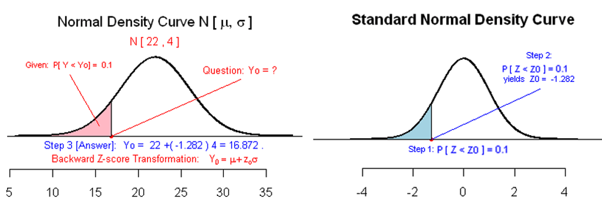
```


The next video demonsrates how to ISLA to answer the above questions.


\

<font color = "darkred"><b>Example 9.</b></font>	In redesigning jet ejection seats to better accommodate women as pilots, it is found that women’s weights are normally distributed with a mean of 143 lb and a standard deviation of 29 lb.

a). If a woman is randomly selected, what is the probability that she weighs between 163 lb and 201 lb?

b). If the current ejection seat for men weighs between 130 lb and 211 lb, what percentage of women have weights that are within those limits?

c). If a woman is randomly selected, what is the probability that she weighs less than 125 lb?

d). If a woman is randomly selected, what is the probability that she weighs exactly 143 lb?

e). If a woman is randomly selected, what is the probability that she weighs between 90 lb and 130 lb?

f). Find the 10th percentile P10, that is, the weight separating the bottom 10% from the top 90%.

**Solution** The following are brief solutions with graphical explanations.

a).   P(163 < X < 201) = P(0.69 < Z < 2) = P(Z < 2) - P(Z < 0.69) = 0.9772 - 0.7549 = 0.2223.
\

```{r fig.align='center', out.width="89%"}
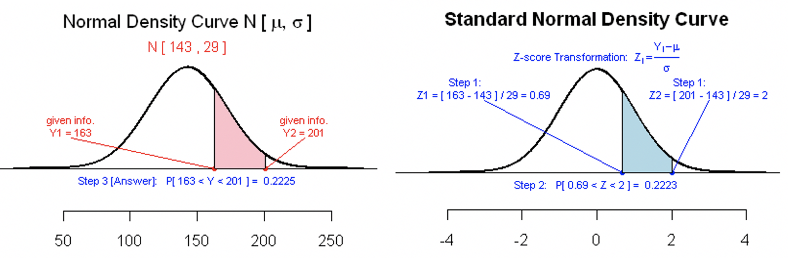
```


b).   P(130 < X < 211) = P(-0.45 < Z < 2.35) = P(Z < 2.35) - P(Z < -0.45) = 0.9906 - 0.3264 = 0.6642.
\

```{r fig.align='center', out.width="89%"}
include_graphics("week04/example09b.png")
```


c).   P(X < 125) =  P(Z < -0.62) = 0.2676.

\

```{r fig.align='center', out.width="89%"}
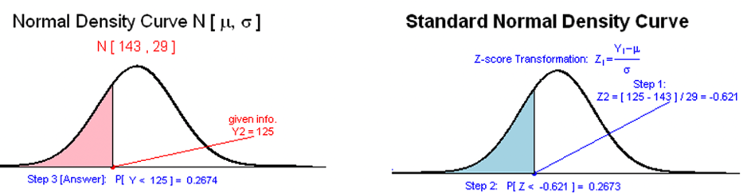
```


d).   P(x=143) = 0.

e).   P(90 < X < 130) = P(-1.83 < Z < -0.45) = P(Z < -0.45) - P(Z < -1.83) = 0.3264 - 0.0336 = 0.2928.

\

```{r fig.align='center', out.width="89%"}
include_graphics("week04/example09e.png")
```


f). P(z < $z_0$) = 0.1, so we get $z_0$ = -1.285. The $P_{10}$ is calculated by $x = 143-1.285\times 29 = 105.73$.

\


```{r fig.align='center', out.width="89%"}
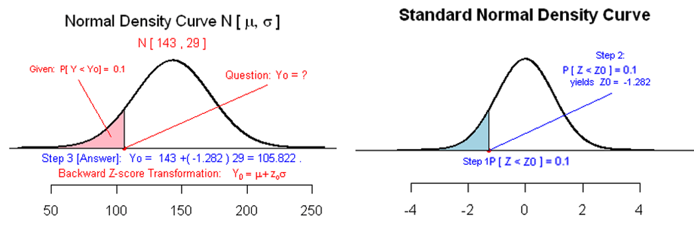
```


# Use of Technology

**ISLA** has two apps to solve stabdard  normal and general normal distribution problems. 

* The interactive **standard normal table** can be found at: <https://wcupeng.shinyapps.io/ZTable/>

* Apps for solving general normal distribution problems can be found at <https://pengdsci.github.io/ISLA/ISLA-03.html>.


## Example 1 - Standard normal distribution

We still use the **Thermometer**  example with the following two questions.

(1) Randomly select a thermometer, what is the probability the reading of this thermometer in the ice water is bigger than 0.5?

(2) what is the cut-off reading that 75% of the readings of this type of thermometers in the ice water are higher than this cut-off?


## Example 2 - General normal distribution 


**Blood Pressure** The distribution of diastolic blood pressure for men is normally distributed with a mean of about 80 and a standard deviation of 20.

(1) Randomly select a man from the population, what is the probability that his diastolic blood pressure is higher than 95.

(2) What is the cut-off diastolic blood pressure that 90% diastolic blood pressures are higher than it?


# Exponential Distribution (Optional)

The **exponential distribution** is a continuous probability distribution that models the time between events in a **process**, where events occur continuously and independently at a constant average rate.

**Random Variable Definition**: Let $X$ be a continuous random variable representing the **time between consecutive events** (or waiting time until the next event). $X$) takes values $x \geq 0$.


**Probability Density Function**: For \( x \geq 0 \),  

$$
f(x; \lambda) = \lambda e^{-\lambda x}
$$

where:

- $\lambda > 0$ is the **rate parameter** (average number of events per unit time)

- $e$ is Euler's number ($\approx 2.71828$)

The parameter $\lambda$ can also be expressed in terms of the **scale parameter** $\beta = 1/\lambda$, which represents the mean time between events. The following figure shows a few density curves with different $\lambda$ values


```{r echo = FALSE, fig.align='center', out.width="70%"}
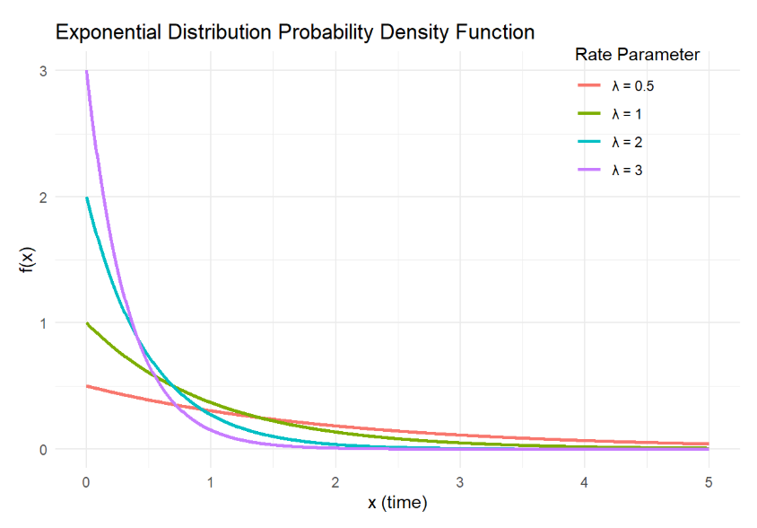
```


```{r fig.align='center', fig.width = 7, fig.height=5}

library(ggplot2)

# Create data for visualization
x_vals <- seq(0, 5, length.out = 1000)
rates <- c(0.5, 1, 2, 3)  # Different lambda values

df <- data.frame()
for (rate in rates) {
  pdf_vals <- dexp(x_vals, rate = rate)
  df <- rbind(df, data.frame(x = x_vals, 
                             pdf = pdf_vals, 
                             lambda = paste0("λ = ", rate)))
}

# Plot
exp <- ggplot(df, aes(x = x, y = pdf, color = lambda)) +
  geom_line(linewidth = 1) +
  labs(title = "Exponential Distribution Probability Density Function",
       x = "x (time)",
       y = "f(x)",
       color = "Rate Parameter"
       ) +
  theme_minimal() +
  theme(#legend.position = "bottom",
         plot.margin = margin(t = 40, r = 40, b = 20, l = 20, unit = "pt"),
         legend.position = c(0.85, 0.85))  # 85% from left, 85% from bottom
```


**Expectation and Variance**


* **Mean (Expected Value)**: The expected value (**mean**) of the exponential random variable is equal to the reciprocal of the rate. That is,

$$
E[X] = \frac{1}{\lambda}
$$


* **Variance**: The variance of the exponential random variable is equal to the reciprocal of the squared rate. That is,
$$
\text{Var}(X) = \frac{1}{\lambda^2}
$$


* **Standard Deviation**: $\sigma = \frac{1}{\lambda}$ (same as the mean)

\

Unlike the normal distribution whose CDF doesn't have a elementary algebraic form, the cumulative probability function of an exponential random variable has simple closed algebraic expression.

$$
F(x) = P(X \le x)= 1- e^{-\lambda x}  = \text{ area of the shaded region}
$$

```{r fig.align='center', out.width="59%"}
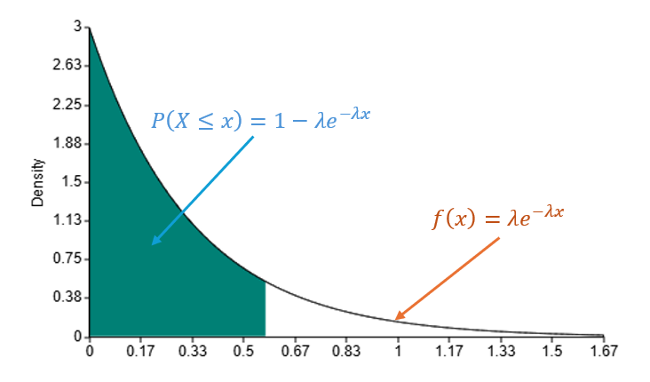
```


For given $0 \le a \le X \le b$, the probability $P(a \le X \le b)$ is given by

$$
P(a \le X \le b) = P(X < b) - P(X < a) = (1- e^{-\lambda b}) - (1 -  e^{-\lambda a}) =  e^{-\lambda a} -  e^{-\lambda b}.
$$

The above probability is reflected in the following figure.


```{r fig.align='center', out.width="59%"}
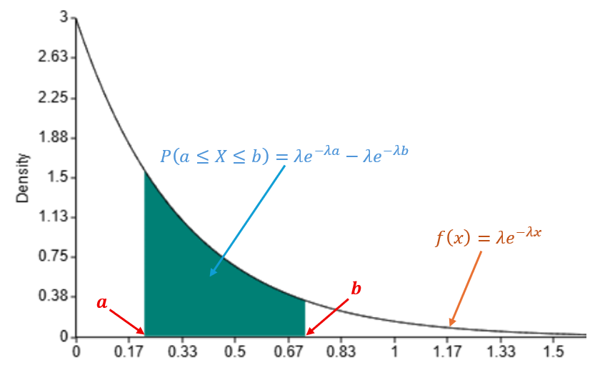
```


**Example 1: Customer Service Call Center** A call center receives support calls at an average rate of 3 calls **per hour**. What is the probability that the next call will arrive within 10 **minutes**?
 
 
**Solution**: since the rate $\lambda = 3$, the density function has the following form

$$
f(x) = 3 e^{-3x} \ \ \text{ for } x \ge 0.
$$
 
The probability that the next call will arrive within 10 minutes (i.e, 10/60 = 1/6) is given by

$$
P(X \le 1/6) = 1 - e^{-3\times (1/6)} = 1 - e^{-1/2} = 0.3935.
$$


```{r fig.align='center', out.width="59%"}
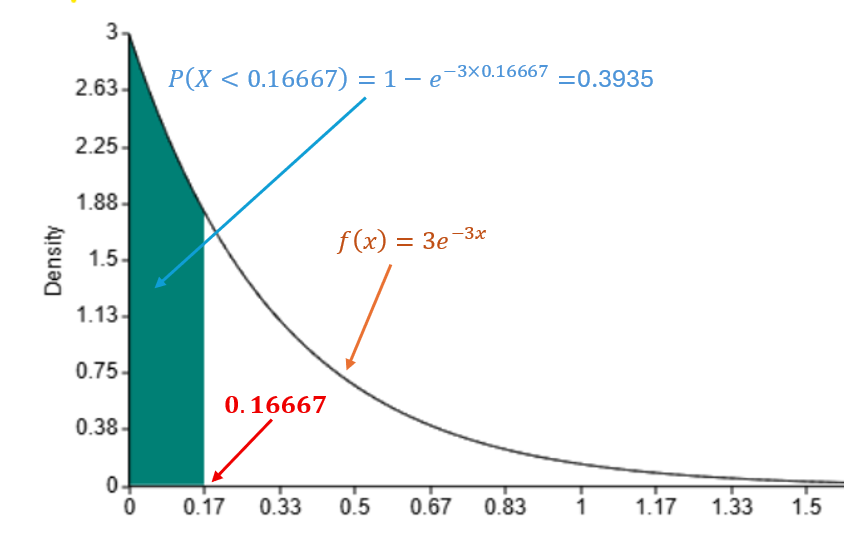
```


**Example 2: Equipment Failure Time** An industrial machine has an average failure time of 50 hours (mean time between failures). What is the probability it will operate for at least 75 hours before failing?

**Solution**: The random variable $X$ be the failure time.  We are given that $E[X] = 50$,  The rate $\lambda = 1/50 = 0.02$. The probability density function is given by

$$
f(x) = \lambda e^{-\lambda x} = 0.02 e^{-0.02 x} \ \ \text{ for } \ \ x \ge 0.
$$

The desired probability 

$$
P(X \ge 75) = 1 - P(X \le 75) = 1 -(1 - e^{-0.02\times 75}) = e^{-0.02\times 75} = 0.22313.
$$

The probability is shown in the following figure.

```{r fig.align='center', out.width="59%"}
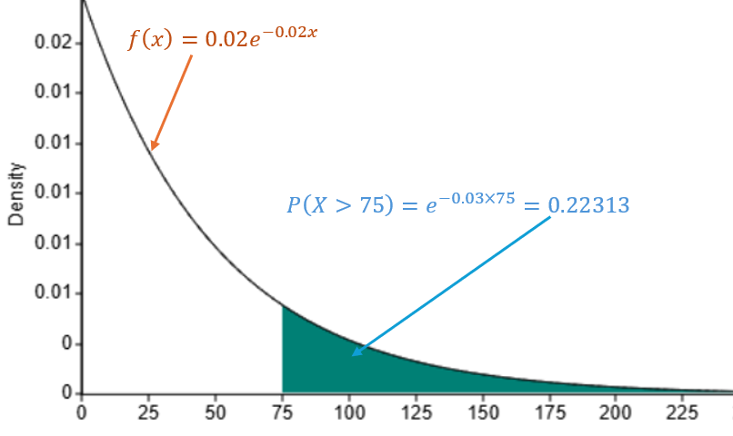
```

\

# Practice Exercises

**Exercise 1: Manufacturing Quality Control** A factory produces metal rods that are supposed to be 100 cm long. Due to natural variations in the process, the actual lengths are normally distributed with a mean (μ) of 100 cm and a standard deviation (σ) of 0.2 cm. The quality control department rejects any rod that is shorter than 99.5 cm or longer than 100.8 cm.

a) What percentage of rods are within the acceptable range (not rejected)?

b) If the factory produces 10,000 rods in a day, how many are expected to be rejected?


<font color = "red">
<span  onclick="toggle_visibility('q01');" class="view"><font color = "blue"><b>View Answer</b></font></span>
<div id="q01" class="showanswer" style="display: none;" > 
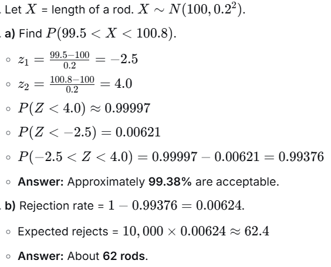</center>
</p></div><br/>
</font>


**Exercise 2: Exam Scores and Grading on a Curve** The scores on a national standardized test are normally distributed with a mean of 500 and a standard deviation of 100. A prestigious scholarship is awarded to students who score in the top 2% of all test-takers.

a) What is the minimum score needed to qualify for the scholarship?

b) What percentage of students score between 450 and 650?


<font color = "red">
<span  onclick="toggle_visibility('q02');" class="view"><font color = "blue"><b>View Answer</b></font></span>
<div id="q02" class="showanswer" style="display: none;" > 
**Part a: Minimum Score for Top 2%**

Let $X \sim N(500, 100^2)$.

1. Find $z$-score for 98th percentile (since top 2% means $P(Z > z) = 0.02$, so $P(Z < z) = 0.98$):
   - From z-table: $z \approx 2.054$

2. Convert $z$-score to raw score:
   $$x = \mu + z\sigma = 500 + 2.054(100) = 705.4$$

**Answer:** Minimum score needed is approximately **705**.

**Part b: Percentage Between 450 and 650**

1. Standardize the scores:

   - $z_1 = \frac{450 - 500}{100} = -0.5$
   - $z_2 = \frac{650 - 500}{100} = 1.5$


2. Using standard normal distribution table:

   - $P(Z < 1.5) = 0.93319$
   - $P(Z < -0.5) = 0.30854$

3. Calculate probability between scores:
   $$P(-0.5 < Z < 1.5) = 0.93319 - 0.30854 = 0.62465$$

**Answer:** About **62.47%** of students score between 450 and 650.

</p></div><br/>
</font>


**Exercise 3: Medicine & Blood Pressure** Systolic blood pressure for a healthy adult population is approximately normally distributed with a mean of 120 mmHg and a standard deviation of 10 mmHg. A reading above 140 mmHg is classified as Stage 1 Hypertension.

a) What percentage of this healthy population would be misclassified as having hypertension based on this single measure?  

b) What systolic blood pressure marks the 90th percentile (i.e., only 10% of the population has a pressure higher than this value)?


<font color = "red">
<span  onclick="toggle_visibility('q03');" class="view"><font color = "blue"><b>View Answer</b></font></span>
<div id="q03" class="showanswer" style="display: none;" > 

**Part a: Percentage Misclassified as Hypertensive**

Let $X \sim N(120, 10^2)$.

1. Standardize the hypertension threshold:

   $$z = \frac{140 - 120}{10} = 2.0$$

2. Calculate probability above this value:

   $$P(Z > 2.0) = 1 - P(Z < 2.0) = 1 - 0.97725 = 0.02275$$

**Answer:** Approximately **2.28%** would be misclassified.

**Part b: 90th Percentile Blood Pressure**

1. Find $z$-score for 90th percentile:

   - From z-table: $z \approx 1.282$ (since $P(Z < 1.282) \approx 0.90$)

2. Convert to blood pressure reading:

$$
   x = 120 + 1.282(10) = 132.82
$$

**Answer:** The 90th percentile blood pressure is approximately **132.8 mmHg**.

</p></div><br/>
</font>


**Exercise 4: Business & Customer Service** A technical support call center has found that the time (in minutes) a representative spends resolving a customer issue follows a normal distribution with a mean of 12 minutes and a standard deviation of 3.5 minutes. The company's goal is to resolve 80% of calls within 15 minutes.

a) What percentage of calls currently meet this 15-minute goal?  

b) To incentivize efficiency, management wants to give a bonus to representatives who resolve calls faster than 90% of their peers. How fast must a representative resolve a call to earn this bonus?


<font color = "red">
<span  onclick="toggle_visibility('q04');" class="view"><font color = "blue"><b>View Answer</b></font></span>
<div id="q04" class="showanswer" style="display: none;" > 

**Part a: Percentage Meeting 15-Minute Goal**

Let $X \sim N(12, 3.5^2)$.

1. Standardize the goal time:
   $$z = \frac{15 - 12}{3.5} \approx 0.857$$

2. Using standard normal distribution table:
   $$P(Z < 0.857) \approx 0.8043$$

**Answer:** Currently **80.43%** of calls meet the 15-minute goal.

**Part b: Time for Bonus Qualification**

1. "Faster than 90% of peers" means at the 10th percentile.
2. Find $z$-score for 10th percentile:
   - From z-table: $z \approx -1.282$ (since $P(Z < -1.282) \approx 0.10$)

3. Convert to resolution time:
   $$x = 12 + (-1.282)(3.5) \approx 12 - 4.487 = 7.513$$

**Answer:** A representative must resolve calls in less than **7.5 minutes** to earn the bonus.

</p></div><br/>
</font>
